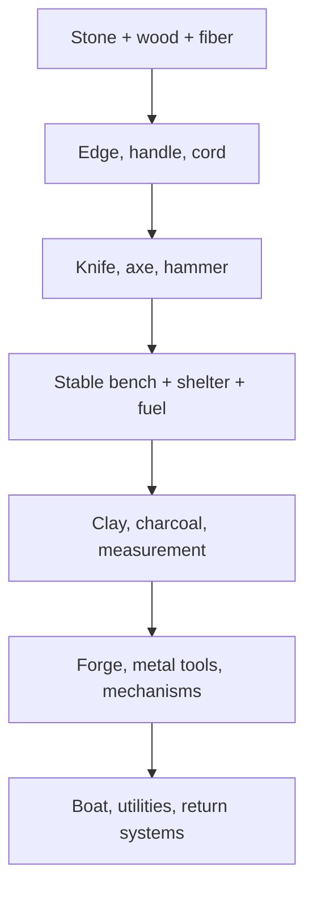

# THE FIRST NIGHT — THE HANDS REMEMBER WHAT THE MIND CAN EXPLAIN
## Design Bible v2.8 — Crafting, Workspaces, Knowledge, Experience, and Character-Growth Constitution

**Project:** THE FIRST NIGHT 3D  
**Authority date:** 2026-08-12  
**Status:** Governing design successor to v2.3–v2.7 for crafting, learning, and character progression  
**Production truth:** Designed, not implemented or Director-device accepted  
**Scope lock:** This document does not authorize broad content production before RT0/v0.1.2 physical usability passes

---

# 0. Executive ruling

The game already possesses the right ideas: an empty pattern book, trial-and-error invention, causal failures, physical knowledge carriers, embodied growth, operation-based workbenches, continuous time, salvage provenance, and a capability hypergraph. The weakness is that these ideas are distributed across several constitutions and are not yet one readable resolver.

v2.8 establishes that resolver.

The player does not gain a universal level and then purchase the right to manufacture an axe. The player encounters a need, notices material behavior, forms a hypothesis, performs operations, reads the result, improves control, tests the object, and eventually proves a pattern. The character changes in parallel: the body adapts, technique becomes less wasteful, knowledge becomes more causal, characteristics create a personal way of solving problems, and earned traits open qualitative options.

The central progression is:

> **Attempt → Observe → Explain → Control → Prove → Generalize → Teach**

The central manufacturing rule is:

> **An object is never gated by a character level. It is gated by the real capabilities needed to make it credibly.**

The central character rule is:

> **A Fallout-like character sheet may make identity readable, but it may not turn survival into invisible account arithmetic.**

The system has seven distinct layers:

| Layer | Question answered | Example |
|---|---|---|
| Characteristics | What kind of person is this, and how do they tend to solve problems? | strong, observant, composed, analytical |
| Body capacities | What can this body sustain and control after adaptation? | load tolerance, grip endurance, balance, breath economy |
| Current condition | What can the person safely do now? | tired, cold, injured, hydrated, calm |
| Practical skill | How reliably can the hands perform this operation? | edge control, knot dressing, fit, heat timing |
| Knowledge | What can the mind explain, predict, and diagnose? | why a binding slips or a seal leaks |
| Pattern proof | Has this specific architecture survived relevant tests? | axe proven in wet hardwood |
| Development traits | What qualitative habit or specialization has the person earned? | Failure Analyst, Load Sense, Patient Teacher |

None silently substitutes for another. High Reasoning does not make injured hands precise. High Strength does not reveal a joint. A manual does not create technique. Repetition without feedback does not create understanding. A perfect workbench does not invent a recipe. A successful accident is not a proven pattern.

---

# 1. Whole-canon audit

## 1.1 What is already strong

v2.3 established the empty build book, the Maker's Spiral, pattern confidence states, causal failure, information-based experience, eight-axis manufacture difficulty, tool ancestry, physical documentation, and anti-grind law.

v2.6 established the Felt Body, five independent contributors to workmanship, continuous human time, persistent partial work, active and passive task phases, and the rule that body, skill, knowledge, tool, and workspace never substitute silently.

v2.7 established operation-based workbench states W0–W6, modular specialist cells, circular material economies, a universal consequence event, body-and-learning equations, and the Second-Life Stewardship clock.

The Castaway Cycle established the Capability Hypergraph, seven earlier body capacities, eighteen transfer motifs, twenty-four knowledge disciplines, and confidence states from Glimpsed to Teachable.

These remain binding unless refined below.

## 1.2 What remained weak

1. **Characteristic, capacity, skill, and knowledge overlap.** Dexterity appears as both a body capacity and a broad competence. Perception and Reasoning sometimes behave like skills and sometimes like attributes.
2. **Experience is conceptually correct but not stage-governed.** The design says meaningful action teaches, but does not define the evidence needed to move from beginner to reliable or adaptive.
3. **Knowledge lacks a strict ledger.** A survivor can acquire clues, principles, procedures, and proof, but their different authority is not always visible.
4. **The workbench ladder is not fully back-chained.** W0–W6 describe operations, but the exact modules, materials, labor, qualification, and maintenance are incomplete.
5. **Craft time is seeded but not resolved.** Base labor, setup, irreversible physical time, passive process time, inspection, and rework need separate treatment.
6. **Quality risks collapsing into one score.** A tool may be sharp but unsafe, strong but too heavy, watertight but impossible to repair.
7. **The Fallout request needs careful translation.** Directly copying levels, Luck, perk points, and recipe perks would contradict the game's physical learning and permanent-death laws.
8. **The hypergraph is not yet player-readable.** The player needs to know what operation is impossible, uncertain, hazardous, or unproven without seeing a spoiler tree.
9. **Progression choice is weak.** Learning-by-doing creates growth, but it does not yet give the player enough authored identity decisions.
10. **Successor requalification needs exact rules.** Physical archives persist, but the speed and limits of reacquiring documented work are not quantified.

## 1.3 Benchmark translation

Fallout's S.P.E.C.I.A.L. system succeeds because seven memorable attributes make a build legible and because perks let the player make qualitative choices. Fallout 76 also ties perk capacity to attributes. THE FIRST NIGHT adopts the readability and meaningful branching, but rejects universal character levels, randomized perk acquisition, recipe-granting perks, and inventory-weight bonuses that make matter disappear. [Bethesda's official Fallout 76 progression overview](https://fallout.bethesda.net/en/article/our-future-begins-whats-new-in-fallout-76)

Project Zomboid's developers identify the exact danger facing this project: a deep tree can become unbelievable catalogue clutter, and realistic multi-stage work can cross into tedium. Their proposed remedies—contextual learning, shared concepts, professions, workstations, selectable inputs, part condition, and alternatives to manufacturing hundreds of objects for XP—are valuable. THE FIRST NIGHT goes further by making every pattern evidence-bound and every failed operation physically persistent. [Project Zomboid crafting design](https://projectzomboid.com/blog/news/2023/04/crafting-ramblz/), [Build 42.20 features](https://projectzomboid.com/blog/features-overview-build-42-20/)

Vintage Story demonstrates that manufacturing is memorable when stone, clay, casting, and smithing each have their own physical verb and temporal structure. THE FIRST NIGHT adopts tactile operations, staged material transformation, and persistent intermediate states, but rejects the always-complete handbook and predetermined output silhouettes before discovery. [Vintage Story crafting guide](https://wiki.vintagestory.at/Crafting)

The Challenge Point Framework supports a central progression law: learning depends on the relationship between task difficulty, current ability, and interpretable information. A task that is trivial teaches little; a task that overwhelms the learner may produce failure without usable learning. [Guadagnoli & Lee, 2004](https://pubmed.ncbi.nlm.nih.gov/15130871/)

Motor-learning research also distinguishes immediate practice performance from retained learning. Good-looking repetition during one session is not automatically durable skill, and progressively varied practice supports transfer better than endless identical repetition. Sleep and recovery contribute to consolidation. [Learning–performance distinction](https://pubmed.ncbi.nlm.nih.gov/22142953/), [progressive contextual interference](https://pubmed.ncbi.nlm.nih.gov/20845219/), [memory and sleep](https://pubmed.ncbi.nlm.nih.gov/20046194/)

---

# 2. Constitutional laws 201–235

## Law 201 — Progression has one resolver

Every activity writes to body, condition, technique, knowledge, objects, world, and character meaning through one consequence event. Separate mini-XP systems are forbidden.

## Law 202 — There is no universal character level

The survivor never becomes “Level 30.” Progress is visible through characteristics, capacities, skill stages, knowledge confidence, proven patterns, traits, objects, and changed world capability.

## Law 203 — Eight characteristics make identity readable

Strength, Endurance, Mobility, Dexterity, Perception, Reasoning, Composure, and Rapport form the player-facing characteristic frame.

## Law 204 — Characteristics influence methods, not permissions

A low characteristic creates slower, safer, assisted, mechanical, or social routes. It may not place a red lock over an otherwise possible action.

## Law 205 — Characteristics change slowly and asymmetrically

They emerge from structure, life history, adaptation, injury, aging, habits, and meaningful choices. They are neither fixed birth stats nor rapidly farmed points.

## Law 206 — Current condition has priority over potential

Cold, pain, dehydration, fatigue, panic, illness, and injury may temporarily reduce performance below long-term capability.

## Law 207 — Skill means controlled execution

Practical skill stores setup quality, timing, force control, error detection, correction, economy, safe stopping, and transfer across relevant variation.

## Law 208 — Knowledge means a causal model

Knowledge stores observations, propositions, evidence, contradictions, context limits, hazards, predictions, and next tests. Item possession is not knowledge.

## Law 209 — Experience is evidence, not currency

Experience is the history of meaningful attempts. It is distributed to specific techniques, materials, systems, body stimuli, and knowledge propositions; it cannot be spent anywhere.

## Law 210 — Every meaningful action has consequences; not every action creates growth

Walking may consume time, water, energy, and footwear without improving Endurance if it is trivial. Repetition can maintain competence, create fatigue, or produce wear even when permanent growth is saturated.

## Law 211 — Learning requires interpretable challenge

Productive learning depends on challenge fit, novelty, feedback, agency, causal clarity, variation, and recovery. Reckless overload is not advanced training.

## Law 212 — Consolidation separates practice from mastery

Technique may improve during a session, but durable stage advancement requires later reproduction, retention, varied context, and adequate recovery.

## Law 213 — A trait is an earned way of working

Traits change options, warnings, preparation, diagnosis, teaching, or efficiency. They are not generic percentage bonuses and never grant unknown patterns.

## Law 214 — Trait eligibility is junction-based

A trait requires characteristic tendency, relevant technique, knowledge, proof, and a meaningful event. There are no universal perk points.

## Law 215 — Character choice survives without permanent class prisons

When a junction is qualified, the player chooses which habit to crystallize first. Other routes may be earned later through distinct evidence; no survivor can master everything cheaply within one life.

## Law 216 — The pattern book remains empty

No attribute, skill stage, trait, workbench, resource pickup, or manual inserts a manufacture-ready object into the book.

## Law 217 — Attemptability and credibility are separate

A novice may attempt difficult work when a physical operation can begin. The game exposes uncertainty, hazard, time, likely rework, missing verification, and component consequence rather than issuing a level lock.

## Law 218 — Crafting is a capability hypergraph

Every output back-chains through matter, forms, components, operations, tools, workspace, body, characteristics, technique, knowledge, environment, time, energy, and proof. Several alternative routes may satisfy one need.

## Law 219 — A crafting table is a physical control system

Workbench growth provides support, workholding, alignment, measurement, cleanliness, force, heat separation, power, testing, and storage. It never opens recipes.

## Law 220 — Slot count represents controlled relations

W0 begins with two active relations because the body can stabilize only so much. Added surfaces, clamps, pegs, jigs, and fixtures expand controlled relations. Experience alone does not create extra invisible hands.

## Law 221 — Prepared subassemblies preserve complexity

A hafted head, bearing unit, sealed battery enclosure, or woven panel can occupy one controlled relation while retaining its components, quality, provenance, and failure modes.

## Law 222 — Time has five separate causes

Every manufacture declares setup, active labor, irreversible process time, passive condition time, and inspection/rework. Mastery may compress labor and correction; it does not delete drying, curing, cooling, growth, travel, or safe testing.

## Law 223 — Progress persists through interruption

Partial cuts, drilled holes, heated stock, soaked fiber, fitted joints, curing seals, and disassembled mechanisms remain world states.

## Law 224 — Quality is a vector

Function, strength, durability, efficiency, safety, precision, cleanliness, repairability, yield, and finish remain separate. Life-critical objects are governed by their weakest critical property.

## Law 225 — Failure follows operations

Matter may chip, tear, slip, scorch, warp, contaminate, misalign, seize, leak, loosen, or fracture. Hidden failure rolls may choose variation only inside a causal envelope already established by material, method, condition, and control.

## Law 226 — Waste remains evidence and matter

Offcuts, chips, spoiled adhesive, bent fasteners, cracked pottery, swarf, ash, slag, contaminated cloth, and broken parts keep mass, hazard, and possible reuse.

## Law 227 — Found, repaired, and manufactured are different routes

An item family may support one, two, or all three routes only where credible. Each route has different knowledge, provenance, maintenance, and replacement implications.

## Law 228 — Workmanship belongs to phases

An object stores who performed each critical operation, under which condition, with which tool and test. One expert final touch cannot erase a concealed novice defect.

## Law 229 — Better tools improve control before speed

The first benefits of improved equipment are safer holding, clearer feedback, lower material damage, better repeatability, and wider verification. Throughput follows later.

## Law 230 — Reproduction is not proof of transfer

Making the same object from the same material at the same bench demonstrates consistency. Adaptive mastery requires changed material, load, scale, weather, or architecture.

## Law 231 — Documentation has quality

A note may be illegible, incomplete, wrong, outdated, untested, or context-bound. A documented pattern carries author, version, evidence, known limits, measurements, tools, tests, and failure warnings.

## Law 232 — Successors requalify, not remember

A successor can study records, inspect objects, use jigs, and follow checklists to move quickly into Guided or Functional performance, but must personally reproduce and prove life-critical work.

## Law 233 — Player knowledge never becomes survivor skill automatically

The player may remember a solution from a prior life. The new castaway still lacks physical technique and legitimate in-world evidence unless a carrier remains.

## Law 234 — Progression must be felt blind

If testers cannot perceive steadier gait, fewer corrective motions, better rhythm, clearer diagnosis, reduced setup loss, broader safe options, or improved work quality without opening a menu, the progression has failed.

## Law 235 — Representative-first scope remains binding

The system must first prove stone edge → cord → handled cutter → axe → W1 bench → shelter/fire/water improvement. A 500-item catalogue before this loop is enjoyable is prohibited.

---

# 3. Character architecture — Fallout clarity without Fallout abstraction

## 3.1 The eight characteristics

Characteristics use an internal continuous scale for simulation and a player-facing **1–10 band** for readability. A displayed point is a broad band, not a promise that every person with Strength 6 is identical.

| Characteristic | Governs | Develops through | Does not grant |
|---|---|---|---|
| Strength | controllable force, lifting, bracing, impact stability | progressive force work plus recovery | carry-weight magic, knowledge, safe rigging |
| Endurance | sustainable output, reserve recovery, work-duration tolerance | paced walking, labor, paddling, swimming, recovery | immunity to thirst, heat, injury, sleep loss |
| Mobility | posture, joint range, acceleration, climbing, uneven-ground movement | varied safe movement, balance work, recovery | immunity to terrain or falls |
| Dexterity | fine control, bimanual coordination, hand economy, correction | varied precise work with feedback | material knowledge or adequate tools |
| Perception | noticing state, change, pattern, sound, smell, trace, misalignment | comparison, observation practice, instruments | facts outside available evidence |
| Reasoning | causal models, sequencing, substitution, diagnosis, planning | tested hypotheses, reconstruction, reflection | physical technique or guaranteed truth |
| Composure | attention under pressure, abort discipline, pain/fear management | staged exposure, rehearsal, recovery, meaningful survival | fearlessness or erased trauma |
| Rapport | teaching, trust, animal handling, cooperation, negotiation | successful communication, care, handoff, repair of trust | mind control, automatic taming, social recipes |

### Stable structure versus characteristic

Stature, limb history, age band, body mass, dominant hand, sensory impairment, scars, chronic injury, and prior life are not spendable attributes. They shape the cost and route of development. A short character may work efficiently in confined wrecks; a tall character may gain reach and leverage but need more clearance. Neither is globally superior.

### Slow development

Strength, Endurance, Mobility, and some aspects of Dexterity change through weeks and months of recovered use. Perception and Reasoning primarily improve through better comparison, models, instruments, and relevant knowledge rather than supernatural sensory or intelligence inflation. Composure changes through staged success, trauma, safety, and reflection. Rapport develops through relationships and consistent behavior.

Major injury, illness, prolonged malnutrition, disuse, aging, trauma, and poor recovery can reduce performance or alter the route permanently.

## 3.2 Body capacities beneath the characteristics

The eight characteristics are legible summaries. The simulation retains specific capacities:

- load tolerance;
- grip endurance;
- gait economy;
- balance on ground and moving craft;
- joint mobility;
- breath economy;
- water confidence;
- heat and cold acclimatization;
- fine steadiness;
- hand-skin and tendon conditioning;
- recovery quality;
- pain-limited compensation.

Walking speed, haul envelope, tool rhythm, climbing, swim economy, and safe work duration are derived outputs, never single owned stats.

## 3.3 Current condition

The resolver applies current stamina, hydration, energy, thermal state, sleep debt, nutrition availability, pain, illness, stress, wetness, breath reserve, and body-part impairment after long-term capability. A master smith with cold numb hands is presently a poor fine worker. A strong survivor with severe diarrhea may be unable to safely haul.

## 3.4 Life Before and crash-start profile

Each new castaway receives a **Life Before**, not a class:

- two characteristic inclinations;
- one underdeveloped or impaired area;
- several glimpsed principles or familiar symbols;
- limited guided technique in credible operations;
- a personal habit or bias;
- no island-specific proven patterns;
- no inherited invisible XP.

Examples include mechanic's assistant, nurse, deckhand, teacher, farm worker, amateur climber, cook, electrician, tailor, student, office worker, or retiree. A mechanic recognizes subsystems and labels but can still destroy a corroded unfamiliar engine. A nurse understands contamination and monitoring but cannot forge a scalpel. A farmer knows plant-care principles but must learn the island's species and seasons.

The first survivor may be authored for onboarding. Later successors may be partially chosen, discovered through the Human Thread, or generated within bounded believable histories.

---

# 4. Skill architecture

## 4.1 Skill is procedural control

The survivor does not possess “Crafting 47.” Skill records operation and context:

- setup;
- posture and grip;
- force and timing;
- sequencing;
- sensory cue use;
- error recognition;
- corrective action;
- safe abort;
- material conservation;
- repeatability;
- transfer.

## 4.2 Player-facing families and underlying strands

The Skills tab uses ten readable families. Each opens into evidence strands rather than one bar.

| Family | Example technique strands | Example knowledge strands |
|---|---|---|
| Body & Movement | gait, load carriage, lifting, climbing, recovery pacing | routes, pack fit, terrain, body warning signs |
| Wood & Structure | edge use, splitting, hewing, boring, joinery, erection | timber behavior, load paths, moisture, decay |
| Stone, Earth & Ceramic | fracture, digging, masonry, clay forming, firing | geology, soil, drainage, ceramic heat history |
| Fiber & Flexible Materials | extraction, twist, knot, weave, sew, net, laminate | fiber grading, wet behavior, abrasion, cleanliness |
| Fire, Food & Heat | ignition, fuel control, cooking, drying, smoking, hot work | combustion, food safety, heat transfer, preservation |
| Water, Health & Sanitation | source handling, treatment, wound care, monitoring | contamination, illness timing, hygiene, physiology |
| Nature & Animals | forage, cultivation, tracking, fishing, hunting, handling | species, soil, season, behavior, feed, ecology |
| Salvage & Mechanics | inspection, dismantling, fit, seal, lubrication, rigging | provenance, corrosion, loads, mechanisms, fluids |
| Metal, Power & Instruments | cold work, forging, casting, circuits, calibration | metallurgy, electricity, energy, measurement |
| Sea, Navigation & Society | swimming, diving, seamanship, charting, teaching | weather, current, navigation, communication, trade |

The twenty-four earlier disciplines remain valid as authoring tags beneath these ten families. The eighteen transfer motifs remain cross-domain technique tags.

## 4.3 Practical skill stages

| Stage | Evidence requirement | Typical behavior |
|---|---|---|
| Untried | no meaningful execution | large uncertainty; needs demonstration or cautious experiment |
| Guided | completed phases with checklist, teacher, jig, or strong prompt | slow; frequent pauses; detects obvious errors |
| Functional | reproduced a familiar operation with acceptable result | works in normal known conditions; high setup and inspection time |
| Reliable | retained control across repeated sessions and minor variation | economical motion; lower rework; earlier warning |
| Adaptive | succeeds across meaningful changes of material, scale, or environment | selects method and compensates before failure |
| Masterful | controls edge cases, designs fixtures, and protects scarce matter | high yield, clear diagnosis, robust planning |
| Teachable | can expose causes, observe another person, correct safely, and verify transfer | produces successors rather than copies |

Stage advancement is conjunctive. An internal evidence score may fill, but the stage changes only when required variety, retention, diagnosis, and proof are present.

## 4.4 Transfer is motif-bound

Skill transfers only through shared operations. Edge control learned on stone modestly helps controlled scraping and blade maintenance. Tension reading learned in shelter lashings helps rigging and bow-making. It does not teach hydrodynamics, engine timing, or wound anatomy.

Each task declares transfer motifs and coefficients. A relevant prior skill may shorten Guided practice, improve warning, or reduce setup errors; it may not create Independent performance automatically.

## 4.5 Skill rust

- familiar low-risk operations remain for long periods;
- fine timing and high-precision calibration rust sooner;
- illness, injury, aging, and changed tools can reveal rust;
- documentation and jigs reduce reacquisition time;
- requalification is much faster than first learning;
- successors do not receive the dead survivor's rust-resistant tacit memory.

---

# 5. Knowledge architecture

## 5.1 Knowledge is proposition-based

Knowledge is stored as claims that can be supported, contradicted, scoped, and tested:

- “This coir twist holds dry tension but swells and slips at this knot when wet.”
- “This aircraft panel coating produces unsafe residue under heat.”
- “The pond exposure is associated with delayed gastrointestinal illness.”
- “The repaired seam leaks after repeated flex, not at static fill.”

A broad discipline score never replaces these claims.

## 5.2 Knowledge states

| State | Meaning | Player support |
|---|---|---|
| Observed | event or clue recorded without explanation | raw note, sample, photograph/drawing, object state |
| Suspected | a possible relation has been proposed | hypothesis and uncertainty |
| Supported | more than one credible observation agrees | confidence and known counterevidence |
| Understood | a causal explanation predicts a relevant result | procedure clues, hazards, next test |
| Generalized | principle survives meaningful variation | substitution and context boundaries |
| Teachable | another person can learn and reproduce from the explanation | structured lesson, plan, test, diagnostic cues |

Knowledge confidence and context coverage are separate. Ten identical dry tests may strongly support a dry-use claim while providing no wet-use coverage.

## 5.3 Evidence types

Evidence carries source and reliability:

- direct observation;
- comparison;
- controlled test;
- destructive test;
- disassembly;
- failure diagnosis;
- manual/reference;
- teacher demonstration;
- survivor reproduction;
- instrument measurement;
- long-term field outcome;
- contradictory result.

Manuals provide principles, symbols, candidate procedures, and warnings. They can greatly increase Reasoning efficiency and reduce blind hazard, but they do not create hand control or island-specific proof.

## 5.4 Pattern knowledge remains separate

A knowledge proposition explains a relationship. A pattern specifies an architecture and operation sequence. A skill executes operations. A proven axe therefore requires:

- knowledge of edge, haft, binding, force direction, and failure signs;
- skill in fracture, shaping, seating, binding, and testing;
- a pattern connecting those relations;
- an object that passed relevant proof.

## 5.5 Documentation and inheritance

Each physical knowledge carrier stores:

- author and date/life;
- claim or pattern version;
- source evidence;
- material identity and provenance;
- operation order;
- measurements and tolerances where known;
- tool/workspace assumptions;
- tests passed;
- known failures and hazards;
- untested contexts;
- legibility and condition.

A successor interpreting a complete record may begin at Supported knowledge and Guided technique. They must still reproduce, retain, and requalify critical work.

---

# 6. Experience and learning resolver

## 6.1 One structured event

Every meaningful activity generates:

```text
LearningEvent {
  actor;
  need;
  task;
  material_lots;
  operation_phases;
  characteristic_demands;
  body_stimulus;
  technique_tags;
  knowledge_claims;
  difficulty_vector;
  novelty_dimensions;
  feedback_observed;
  causal_diagnosis;
  variation_context;
  readiness;
  recovery_followup;
  object_world_outcome;
  documentation;
}
```

## 6.2 Information gain

The internal tuning seed is:

```text
learning evidence
  = base information
  × challenge fit
  × novelty
  × feedback quality
  × causal clarity
  × agency
  × readiness to perceive/control
  × anti-repetition
```

Durable consolidation later applies:

```text
retained evidence
  = learning evidence
  × recovery quality
  × later reproduction
  × context coverage
```

These are calibration structures, not player-facing arithmetic.

## 6.3 Productive challenge

Challenge fit peaks slightly above current reliable control. It falls when:

- the action is trivial;
- the same conditions are repeated without new feedback;
- the task is so difficult that results are uninterpretable;
- fatigue, panic, pain, or speed prevents observation;
- the player follows an automated sequence without agency;
- the result is not inspected.

Experts need greater material, environment, scale, or diagnostic variation to keep learning. Novices need clearer feedback, smaller phases, and safer constraints.

## 6.4 Success, failure, and partial work

| Outcome | Technique evidence | Knowledge evidence | World consequence |
|---|---|---|---|
| clean success in familiar context | small consistency | little new | useful object, time/material wear |
| first controlled success | strong | moderate | prototype or demonstrated pattern |
| readable partial success | strong correction | strong diagnosis opportunity | repairable defect |
| explained failure | moderate | strong | damaged/transformed matter plus ruled-out relation |
| unexplained failure | small | unresolved observation | risk and material consequence |
| reckless catastrophic failure | little during event | possible later forensic insight | severe loss/injury |
| varied successful transfer | strong | strong | broader qualification |
| teaching another survivor | moderate refinement | strong metacognition/communication | transferable competence |

## 6.5 Anti-grind

The resolver tracks repetition signatures across task, material, method, environment, load, and outcome. Identical solved repetition approaches maintenance value, not zero consequence. It still consumes time, body reserve, tool life, and material.

The best progression route is useful work with increasing responsibility and variation:

1. observe;
2. assist;
3. perform a phase;
4. reproduce independently;
5. diagnose a defect;
6. change one condition;
7. prove under load;
8. document;
9. teach.

Walking in circles while overloaded, crafting disposable tools, intentional self-injury, deliberate contamination, and repeated known failure remain prohibited optimal strategies.

---

# 7. Development traits — the Fallout-like choice layer

Traits are displayed in an eight-column **Character Constellation**, one family beneath each characteristic. Eligibility appears only after the survivor has encountered the junction; silhouettes of unknown advanced traits are not shown.

Traits are qualitative. They may add a diagnostic cue, safer alternative, preparation option, workflow, communication action, or controlled efficiency. They never grant recipes, resources, immunity, or flat matter-erasing capacity.

## 7.1 Strength traits

| Trait | Earned evidence | Qualitative effect |
|---|---|---|
| Controlled Force | repeated heavy work with clean stops and no overload | wider force-control window; clearer overload cue |
| Load Sense | successful carriage across varied mass/bulk and documented hotspots | predicts balance/fit problems before departure |
| Tool Momentum | reliable impact work with several tool masses | better swing selection and rebound warning |
| Mechanical Advantage | uses leverage/rigging to solve a force limit | proposes brace, lever, pulley, split-load, or team route sooner |

## 7.2 Endurance traits

| Trait | Earned evidence | Qualitative effect |
|---|---|---|
| Work Rhythm | sustained useful work with stable pacing | reduces corrective stops without reducing hydration cost |
| Reserve Keeper | repeated safe turn-backs with reserve | more accurate remaining-work and return-margin forecast |
| Long Haul | qualified repeated routes with recovery | improves pacing plan and pack-break scheduling |
| Recovery Discipline | responds correctly to fatigue and recovery evidence | better recovery forecast; avoids turning debt into false training |

## 7.3 Mobility traits

| Trait | Earned evidence | Qualitative effect |
|---|---|---|
| Sure Foot | varied terrain work without reckless falls | earlier footing and asymmetry cues |
| Low-Profile Worker | safe crouched/confined work | more stable posture options in wrecks and shelters |
| Moving Deck | qualified boat balance and load transfer | better trim/step timing cues on moving craft |
| Climb Economy | staged climbing with correct anchors and aborts | better three-point and load-transfer planning |

## 7.4 Dexterity traits

| Trait | Earned evidence | Qualitative effect |
|---|---|---|
| Soft Hands | preserves fragile/unique parts across repairs | lower handling damage and clearer force feedback |
| Edge Control | reliable knapping, carving, sharpening, or cutting | more precise removal choices and chip warnings |
| Fine Fit | repeated measured assemblies | detects fit/tolerance error earlier |
| Compensating Hand | trained safe off-hand or one-hand adaptation | opens slower alternative methods after relevant impairment |

## 7.5 Perception traits

| Trait | Earned evidence | Qualitative effect |
|---|---|---|
| Material Eye | compares provenance and failure across material lots | reveals more condition cues without revealing hidden composition |
| Sound Diagnosis | validated audible changes in tools/machines/structures | highlights meaningful rhythm, bearing, crack, or leak cues |
| Trace Reader | tracks organism, water, wear, or human work across time | preserves and compares subtle sign |
| Weather Reader | records and tests local weather signals | improves trend confidence and uncertainty display |

## 7.6 Reasoning traits

| Trait | Earned evidence | Qualitative effect |
|---|---|---|
| Failure Analyst | correctly diagnoses several distinct failures | structures competing causes and next discriminating test |
| Substitute Designer | proves a functional substitution | exposes property slots and tradeoffs in known patterns |
| System Mapper | restores or builds a multi-subsystem chain | visualizes dependencies, isolation points, and bottlenecks |
| Standard Maker | creates a tested gauge, template, checklist, or calibration | raises repeatability and successor requalification speed |

## 7.7 Composure traits

| Trait | Earned evidence | Qualitative effect |
|---|---|---|
| Abort Discipline | survives by stopping before reserve or stability is lost | stronger go/no-go and exit cues |
| Crisis Sequencing | resolves a multi-threat event without chaotic switching | supports triage order under time pressure |
| Steady Hands | performs familiar high-stress work while remaining in control | narrows stress penalty for qualified actions only |
| Fear Memory | reflects on a severe event and later re-enters safely | converts a specific aversion into warnings and staged exposure, not immunity |

## 7.8 Rapport traits

| Trait | Earned evidence | Qualitative effect |
|---|---|---|
| Patient Teacher | another survivor reproduces a taught operation | better observation prompts and correction timing |
| Animal Reader | repeated calm handling with correct prediction | more behavior cues and safer distance/approach choices |
| Trust Builder | honors agreements and repairs a failure | stronger cooperation and responsibility handoff |
| Clear Handoff | transfers a project across people/lives successfully | better task state, warning, and verification records |

## 7.9 Choice and limits

At first qualification, the player chooses one eligible trait at the relevant junction. This creates a Fallout-like authored identity moment without a universal perk currency. Other traits remain earnable, but each needs distinct evidence, recovery, and time. Permanent death keeps choice meaningful: one life may become a perceptive diagnostician; another a powerful rigger; another a patient teacher.

---

# 8. Crafting hypergraph and requirements

## 8.1 Node types

The machine-readable graph must contain:

1. sources;
2. material lots;
3. processed forms;
4. components;
5. tools;
6. workspace modules;
7. operations;
8. energy/process conditions;
9. knowledge claims;
10. technique qualifications;
11. pattern states;
12. proof tests;
13. products/end capabilities;
14. maintenance and recovery routes.

Edges declare AND requirements, OR alternatives, optional enhancers, consumed inputs, catalysts/tools, workspace relations, body demands, environmental windows, and proof obligations.

## 8.2 The eleven-gate craft request

Before a phase begins, the resolver checks:

| Gate | Question | If weak |
|---|---|---|
| Need/purpose | What function is intended? | no meaningful hypothesis or test |
| Matter | Are suitable amount, form, and condition present? | substitute, prepare, reduce scale |
| Operation | Can the required transformation be expressed? | inspect, study, experiment |
| Tool | Can force/heat/measurement be applied? | improvise tool, use slower route |
| Workspace | Can the part be held, aligned, cleaned, ventilated, or isolated? | build module, move site, use assistance |
| Body | Can required force, posture, duration, and precision be supplied now? | split task, rest, rig, recruit, redesign |
| Characteristic | Which tendencies help or hinder this method? | more preparation and safer method |
| Skill | Can the operation be controlled? | guidance, jig, sacrificial sample, slower phase |
| Knowledge | Are function, sequence, hazard, and test understood? | uncertainty, candidate plan, diagnostic work |
| Environment/time | Are light, weather, tide, dryness, temperature, and time adequate? | wait, protect, relocate, stage |
| Proof | How will the result be qualified? | object remains unproven |

No gate says “required level 12.”

## 8.3 Core snowball



The graph forks at every stage. A found knife may bypass the first cutter but not edge maintenance, replacement, or knowledge. Salvaged sheet may bypass ore extraction but not identification, safe shaping, fastening, corrosion, and testing. A working engine may bypass manufacture but creates fuel, cooling, mounting, control, spare, and repair obligations.

## 8.4 Representative complete chain

The first controlled production chain is:

> suitable stone → hammerstone → sharp flake → fiber stripping → short cord → safe grip → handled cutter → wood preparation → hafted stone axe → W1 stable bench → pegs/stops → measured shelter parts → improved refuge/fire/water capability

This chain proves all seven progression layers:

- Strength/Endurance/Mobility affect collection and work;
- Dexterity affects edge and binding control;
- Perception notices stone and fiber behavior;
- Reasoning diagnoses loose haft or bad geometry;
- Composure governs safe impact and testing;
- skill grows through controlled operations;
- knowledge grows through material evidence;
- demonstrated patterns enter the normal work menu;
- the bench changes what relations can be controlled;
- the shelter changes survival and recovery;
- the island retains the result after death.

---

# 9. Workbench and crafting-table constitution

## 9.1 W0 — Ground relation

**Physical forms:** flat stone, stump, sand bed, woven mat, body brace.  
**Controlled relations:** two.  
**Operations:** small holding, direct impact, scraping, twisting, wrapping, rough comparison.  
**Typical time to establish:** minutes to several hours depending on surface preparation.  
**Failure:** dirt, lost parts, unstable support, bad posture, hand conflict.  
**Proof:** the workpiece remains stable under intended hand force.

## 9.2 W1 — Stable support

**Core build:**

| Subassembly | Example resources | Required operations | Seed active labor |
|---|---|---|---:|
| top | split log/slab or lashed poles; roughly 20–40 kg dry timber | cut, flatten contact, arrange | 120–300 min |
| base/legs | 4 legs or trestles; braces | cut, notch, lash/peg | 120–360 min |
| joints | 6–12 pegs/wedges or 8–15 m cord | carve, bore/drive, tension | 60–240 min |
| leveling | stone pads/shims; line or water cue | compare, shim, load | 30–90 min |
| sacrificial surface | bark, board, replaceable strip | fit, fasten | 20–60 min |

**Total seed:** 4–10 game-hours for a crude useful version; longer with poor tools or green variable wood.  
**Controlled relations:** three.  
**Operations opened:** two-hand cutting/striking, staged assembly, safer force.  
**Qualification:** stable under expected vertical and side load; no progressive joint movement.

## 9.3 W2 — Held and measured

W2 is not one upgrade. It requires an operation set:

| Module | Resource ancestry | What it enables | Seed labor |
|---|---|---|---:|
| bench stop/hook | hardwood peg/wedge/board | resists cutting force | 30–90 min |
| dogs/pegs | shaped wood or metal | repeated positioning | 30–120 min |
| wedge clamp | jaws, wedges, lining | reversible holding | 2–6 h |
| vise route | jaws, guide, screw/wedge/lever | controlled multi-axis holding | 6–20 h |
| straightedge | seasoned straight stock | comparison, marking | 1–3 h plus seasoning |
| square | two stable members, verified angle | repeatable right-angle relation | 1–4 h plus proof |
| marking line/gauge | cord/pigment or beam/pin | repeatable dimensions | 30 min–3 h |
| boring guide | hard block/tube, alignment marks | controlled hole direction | 2–8 h |

**Controlled relations:** four to six depending on modules.  
**Qualification:** repeated part fit within the tolerance meaningful to the current product; datum and tool error documented.

## 9.4 W3 — Modular craft bench

W3 adds replaceable fixtures, templates, drawers/parts boards, clean inserts, repeatable datums, and safe disassembly. It reduces setup and loss for proven patterns, supports small batches, and makes teaching visible.

**Typical ancestry:** W2 + seasoned stock + reliable joinery + measured interfaces + inventory discipline + several proven jigs.  
**Seed labor:** 20–60 game-hours distributed across useful modules.  
**Obligation:** module inspection, reference verification, stock organization, contamination boundaries.

## 9.5 W4 — Specialist cells

W4 is a network, never one universal table:

- fiber wet/dirty preparation separated from clean textile and bandage work;
- food preparation separated from salvage chemicals and metal swarf;
- medical surface with clean water, light, waste, and instrument control;
- hot-work area with hearth/forge, tongs, anvil/block, quench, ventilation, fire separation;
- mechanical area with drain tray, bearing/fastener control, cleaning, torque/fit cues;
- electrical area with isolation, dry surface, continuity/voltage instruments, fuse practice;
- engine stand and lifting relation;
- proof-load, leak, float, pressure, continuity, and run-test sites.

## 9.6 W5–W6

Powered workshop and legacy boatyard require energy generation/distribution, guarded drives, extraction, lubrication, spares, calibration, lifting, stock control, test stands, shutdown, and standards. They accelerate repeatable operations; they do not automate diagnosis of unknown wrecks or make material identity irrelevant.

---

# 10. Craft time, resources, quality, and failure

## 10.1 Time resolver

For each phase:

```text
active labor time
  = base labor units
  ÷ (method efficiency
     × tool effectiveness
     × workspace control
     × technique economy
     × readiness)
  + setup
  + expected correction
```

```text
phase completion time
  = max(active labor where embodied,
        irreversible process minimum)
  + passive condition time
  + inspection/test
  + rework actually caused
```

The formula must be capped. A novice is slower, but not by absurd orders of magnitude. A master may reduce active labor to roughly 35–70% of a functional worker depending on the operation; physical chemistry and safe testing remain.

## 10.2 Control margin

Each operation evaluates:

```text
control margin
  = practical skill
  + relevant characteristic contribution
  + knowledge/preparation
  + tool feedback and force control
  + workspace control
  + current readiness
  + environmental suitability
  - operation difficulty
```

The weights are operation-specific. Reasoning matters strongly in diagnosis but little in supplying lift force. Strength matters in controlled heavy impact but little in radio calibration. Dexterity matters in fine fit; Perception matters in detecting drift.

A negative margin creates specific defect pressure, not automatic failure. The player may compensate through slower work, smaller scale, sacrificial samples, guidance, jigs, measurement, extra inspection, or a different architecture.

## 10.3 Quality vector

Every product stores at least:

- function;
- geometry/fit;
- structural margin;
- durability;
- efficiency;
- safety;
- contamination/cleanliness;
- repairability;
- material yield;
- known proof envelope;
- finish only where meaningful.

For a crude spoon, finish may be low while function and food-contact safety are adequate. For a pressure vessel, the weakest of material qualification, joint integrity, relief, control, inspection, and proof dominates safety. There is no averaged “rare purple boiler.”

## 10.4 Representative task seeds

| Output | Main resources | Tools/workspace | Minimum learning state | Seed time structure |
|---|---|---|---|---|
| sharp stone edge | 2 suitable stones | hands/W0; eye protection route | no prior experience; hazard warning possible | 5–20 min active |
| 3 m plant cord | graded fiber, water if retted | cutter/W0 | Suspected fiber relation; Guided twist | 15–45 min active plus preparation/drying |
| handled stone knife | flake, grip, cord/resin | hammerstone/W0–W1 | Functional edge handling; Supported haft relation | 30–90 min plus test |
| stone axe | shaped head, haft, wedge/binding | cutter, hammerstone, W1 | Functional fracture/binding; Understood load direction | 1–3 h plus staged impact test |
| crude shovel | fire-hardened wood or stone/metal edge | cutter/axe, fire, W1 | Functional wood shaping; soil need understood | 2–6 h plus soil test |
| W1 bench | 20–40 kg timber, pegs/cord, pads | axe/cutter/hammer, W0 | Functional wood/binding; load path Supported | 4–10 h plus load proof |
| pack frame | light rigid members, cord, padding | cutter, W1 | Functional bindings; load distribution Supported | 2–6 h plus route trials |
| bow | suitable seasoned stave, string, grip | axe/knife/scraper, W2 | Reliable fiber/wood control; Understood bending | 6–20 h active plus days/weeks seasoning and proof |
| clay boiling pot | qualified clay, temper, fuel | forming surface, pit kiln | Functional forming; Supported drying/firing | 1–3 h active + drying + 10–20 h firing/cooling |
| charcoal batch | dry graded wood, sealable mound/retort | fire tools, monitored site | Reliable fire control; Understood low-oxygen process | 2–6 h active across 1–3 days |
| forged axe head | qualified metal stock, fuel | forge, tongs, hammer, anvil, gauges | Reliable hot work; Understood heat/shape; qualified station | 3–8 h across heats plus haft/proof |
| hull patch | compatible panel/fiber/seal/fasteners | W3/mechanical cell, dry support | Reliable fit/seal; understood hull loads | 4–20 h + cure + leak/flex test |
| engine subsystem repair | serviceable parts, fluids, fasteners, seals | W4 mechanical, stand, lifting, instruments | Adaptive diagnosis and reliable fit/cleanliness | days–weeks across preservation, diagnosis, bench, mount, run/sea trials |

All numeric values are calibration seeds. Fun, embodiment, scarcity, daylight, weather, and mobile interaction determine final tuning.

## 10.5 Resource consumption

Each operation separates:

- committed material;
- recoverable offcut;
- reusable component;
- tool wear;
- consumable;
- fuel/energy;
- contamination;
- irreversible transformation;
- test article;
- waste/hazard.

Novices usually lose more to poor layout, excessive removal, damaged surfaces, contamination, and rework. They do not lose a whole engine because a percentage roll failed.

---

# 11. Player-facing experience

## 11.1 Normal play

There is no global Craft or Build button. The Backpack retains Inventory, Vitals, and Skills.

Crafting begins by:

1. inspecting matter or a need in the world;
2. placing objects on a valid relation surface;
3. assigning intended roles and operations;
4. seeing uncertainties, physical conflicts, and hazard cues;
5. performing phases in-world;
6. inspecting/testing the result;
7. recording or revising the pattern.

At W0, two active relations appear as physical staging positions. A third item may be used as a tool, but the character cannot pretend to hold three loose parts together. Subassemblies, clamps, pegs, and jigs expand control.

## 11.2 Unknown versus known work

**Unknown work** appears as a Work Question with properties, candidate operations, uncertainties, and player-authored test.  
**Known demonstrated work** appears as Reproduce/Adapt at a relevant surface, showing functional slots, known substitutions, required operations, tools, warnings, and proof state.  
**Unavailable work** is never shown as a future silhouette. If the player is physically attempting a relation, the interface explains the present problem: unstable holding, unprepared surface, unknown material, no controlled heat, insufficient light, unsafe posture, or no credible test.

## 11.3 Character screen

The Skills tab has four zoom levels:

1. **Character:** eight characteristic bands, current changes, and felt outputs.
2. **Families:** ten skill families with stage statements and active questions.
3. **Evidence:** technique contexts, knowledge claims, contradictions, retention, proofs.
4. **Constellation:** earned and currently eligible development traits.

Useful feedback sounds like:

- “Same beach route, 12 kg: steadier pace; right shoulder still overloaded.”
- “Coir twist is Reliable dry; wet abrasion remains unproven.”
- “Stone edge removal: fewer uncontrolled chips; lateral force still damages this rock.”
- “Engine cooling loop: sequence understood; corroded fastener removal remains Guided.”
- “W1 bench: stable vertically; side-load joint movement observed.”

Avoid:

- +3 Crafting XP;
- Strength increased because one log was lifted;
- recipe unlocked by Workbench Level 2;
- 74% chance to craft axe;
- quality colors without causes;
- ten hidden prerequisite numbers;
- skill growth that is only visible in menus.

---

# 12. Technical records

## 12.1 Character record

```text
CharacterRecord {
  survivor_id;
  life_before;
  stable_structure;
  characteristics[8];
  specific_body_capacities;
  current_condition;
  technique_records;
  knowledge_claims;
  pattern_confidence;
  traits;
  trauma_and_habits;
  teaching_and_handoff_history;
}
```

## 12.2 Technique record

```text
TechniqueRecord {
  operation_tag;
  context_tags;
  evidence_score_internal;
  retained_stage;
  successful_reproductions;
  meaningful_variations;
  diagnoses;
  proof_events;
  last_used;
  rust_state;
  teacher_or_jig_support;
}
```

## 12.3 Knowledge claim

```text
KnowledgeClaim {
  proposition_id;
  statement;
  state;
  supporting_evidence[];
  contradictory_evidence[];
  context_coverage[];
  causal_model;
  confidence_internal;
  hazard_implications;
  next_discriminating_test;
  physical_carriers[];
}
```

## 12.4 Workstation module

```text
WorkstationModule {
  module_id;
  parent_station;
  physical_components[];
  operations_supported[];
  controlled_relations;
  force_limit;
  tolerance_or_measurement_limit;
  cleanliness_class;
  energy_and_ventilation;
  compatible_jigs[];
  qualification_tests[];
  condition;
  maintenance_due;
}
```

## 12.5 Craft phase

```text
CraftPhase {
  operation;
  inputs[];
  tools[];
  workstation_requirements[];
  body_and_characteristic_demands;
  skill_and_knowledge_requirements;
  setup_time;
  base_labor_units;
  irreversible_process_minimum;
  passive_conditions;
  hazard_channels;
  defect_modes[];
  inspection;
  partial_state;
  outputs_and_waste[];
}
```

## 12.6 Graph audits

Automated content validation must reject:

- any recipe/pattern revealed by level, skill, trait, bench, or pickup without evidence;
- a non-source craft node without prerequisites;
- a component with no upstream source or downstream use;
- a life-critical product without proof and recovery route;
- a task time without phase ownership;
- a workbench operation unsupported by a physical module;
- a trait without evidence requirements;
- a skill stage advanced by score alone without variation/retention proof;
- a knowledge claim without source and context;
- an object quality score without causal properties;
- failure that deletes unique matter without a physical path;
- successor access to tacit memory;
- offline work that authors an unknown operation or irreversible decision.

---

# 13. Production gates

## Gate CK0 — RT0 physical usability

Movement, camera, collection, Inventory/Vitals/Skills access, physical staging, cancellation, save/load, and mobile controls pass Director-device testing. No later gate overrides this.

## Gate CK1 — Two-material learning lab

Five materials support inspection, two active relations, at least six operations, partial states, causal failure, and meaningful feedback without a recipe catalogue.

## Gate CK2 — First tool snowball

Stone edge → cord → handled cutter → axe is discoverable, reproducible, testable, and understandable without a wiki.

## Gate CK3 — Unified character resolver

The same activity writes current cost, body stimulus, technique evidence, knowledge evidence, world change, and felt performance. No duplicate XP system exists.

## Gate CK4 — Knowledge ledger

Observation, suspicion, support, understanding, generalization, contradiction, context, and physical carrier work across death/save/load.

## Gate CK5 — W0–W2 workbench

Two, three, and four-to-six controlled relations arise from real surfaces and modules. Clamp, stop, straightedge, square, and guide change execution and failure.

## Gate CK6 — Craft time and interruption

One active task, one passive process, and one major project preserve partial work across interruption, sleep, weather, and reload.

## Gate CK7 — Character constellation

At least eight traits—one per characteristic—are earned through distinct evidence and add qualitative methods or feedback without granting recipes or universal bonuses.

## Gate CK8 — Quality and failure

Two visually similar tools differ causally in edge, haft, binding, mass, safety, durability, repair, and proof. Testers can diagnose the difference.

## Gate CK9 — Successor requalification

A successor finds an object, plan, jig, and failure record; reacquires faster than first invention but cannot instantly perform or trust the work.

## Gate CK10 — Full representative chain

The first chain changes shelter, fire, and water survival in real play and remains enjoyable on desktop, browser, and Android before further tree expansion.

---

# 14. Acceptance constitution

The system passes only when:

1. a new player can discover the first useful tool without random inventory spam or external wiki;
2. every displayed limitation states a physical or epistemic cause;
3. the player can attempt risky advanced work without an arbitrary level lock;
4. ignorance, clumsiness, bad condition, missing tool, weak workspace, and unsuitable material produce different feedback;
5. repeated trivial craft does not become optimal progression;
6. a clearly diagnosed failure can teach more than an unexamined success;
7. skill stage requires retention and variation, not only accumulated points;
8. knowledge confidence preserves contradictions and context boundaries;
9. traits create meaningful character identity without recipes or flat universal bonuses;
10. workbench modules visibly change holding, alignment, cleanliness, measurement, and safety;
11. active labor, passive time, irreversible process time, setup, and test are separately authored;
12. mastery reduces waste and correction before it reduces physical time;
13. partial work persists in the world;
14. quality properties remain causal and inspectable;
15. found, repaired, and manufactured routes have distinct obligations;
16. a successor benefits from inherited matter and records but not dead tacit skill;
17. character development is felt through animation, sound, pace, control, warning, and output;
18. the first complete crafting chain is enjoyable before the content catalogue grows.

Automatic failure occurs if the game uses a universal Crafting level, grants recipes through a bench upgrade, erases unique parts on a failed roll, hides all growth behind bars, makes every action increase a permanent number, or requires a player to manufacture hundreds of useless items to qualify normal work.

---

# 15. Director decisions for the next joint pass

The architecture is coherent enough to prototype. Four identity decisions remain genuinely creative rather than technical:

1. **First-survivor authorship:** fixed authored crash survivor, player-built profile, or a hybrid with bounded allocation.
2. **Trait choice strength:** gentle specialization where most traits remain earnable in one long life, or sharper identity where one life can deeply master only a few constellations.
3. **Numerical visibility:** named stages and evidence statements only, or stages plus optional exact internal progress for players who want it.
4. **Hands-on density:** how many early operations should be directly manipulated versus represented through short embodied phases after the method is proven.

Recommended defaults for prototype:

- hybrid first survivor;
- sharp but non-exclusive specialization;
- named stages by default with optional detailed evidence view;
- high tactile density for discovery and first proof, compressed reproduction after reliable mastery and proper jigs.

---

# 16. Governing signature

> **Let characteristics give the survivor a voice. Let work give the hands memory. Let evidence give the mind knowledge. Let failure leave a cause. Let the bench control real relations. Let time remain in the world. Let proof turn a possibility into a pattern. Let traits record how this person learned to survive. Let death end the person without erasing what they made understandable for the next.**

The soul of THE FIRST NIGHT is not an enormous list of craftable things. It is the transformation of an injured, uncertain person into someone who can read matter, control work, explain failure, build dependable systems, teach what they learned, and leave behind an island that remembers through physical truth.

