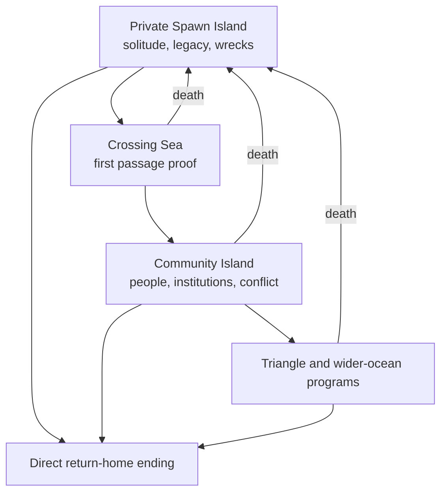

# THE FIRST NIGHT — The Castaway Cycle

**Private Spawn Island, Community Island, Death Continuity and Forking Capability Constitution v0.9 — 26 July 2026**

**Project:** THE FIRST NIGHT  
**Internal codename:** DRIFT / RUSTED  
**Engine and target:** Godot 4.x; first-person 3D; web and Android  
**Status:** Authoritative supplement to v0.7 and v0.8

---

## 1. Executive ruling

THE FIRST NIGHT is no longer one linear journey on one island. It is a
persistent castaway cycle across two fundamentally different places:

1. **The private Spawn Island** belongs to one player. It is always solitary.
   Aircraft, boats and displaced cargo continue to arrive there, but their
   occupants never do. The island can be cultivated, fortified, instrumented,
   industrialized and turned into a launch platform across many character
   lives.
2. **The Community Island** is the closest large island and the only normal
   destination where living people accumulate. It contains other survivors,
   teachers, crews, settlements, trade, politics, rescue, violence, public
   works and collective escape programs.
3. **The sea between them** is not a loading screen. It is the first serious
   proof that the survivor can translate land survival into route planning,
   seamanship, weather judgment, provisions, repair and controlled risk.
4. **The wider ocean and Triangle** contain the eventual return-home endings.
   A survivor may reach one directly from the Spawn Island or may first enter
   the much broader Community Island game.

The constitutional death rule is revised, not discarded:

> **One survivor has one irreversible life. The player has one persistent
> island history.**

When a survivor dies, that human remains dead. Their body, carried possessions,
workmanship, records and consequences remain where the world rules permit. The
player returns to their private Spawn Island as a new castaway with a different
body and no magically inherited strength, technique, memories or relationships.
The island's structures, stores, crops, wrecks, machines, maps, manuals, jigs,
failures and scars persist.

The progression rule is also strengthened:

> **There is no linear skill tree. There is a forking capability hypergraph.**

A capability emerges where body, technique, knowledge, evidence, tools,
environment and, on the Community Island, other people intersect. Every
important development path must fork, cross other paths, encounter a real
bottleneck, and offer more than one credible solution.

The complete experience becomes:

> **Awaken alone → survive → externalize knowledge → transform the Spawn Island
> → choose a passage → reach society or attempt home → specialize, cooperate,
> compete or betray → prove an ending → escape alive, or die and leave another
> human to inherit only what the world can honestly preserve.**

---

## 2. Authority and supersession

This document preserves the material, body, hazard, food, crafting, maritime,
social and ending catalogs of v0.5–v0.8. It makes four binding changes.

| Earlier rule | v0.9 ruling |
|---|---|
| Death could be followed by a later new arrival, but no fixed re-entry place was guaranteed | Every player re-enters through their own persistent private Spawn Island |
| “If you die, you die” could be read as ending all continued play | It ends that survivor permanently; it does not delete the player's island history |
| One living island held both solitary survival and society | Private Spawn Island and populated Community Island are now distinct world layers |
| Some examples were written as long arrow chains | Those arrows are illustrative routes only; runtime development is a branching, recombining hypergraph |

The following remain binding:

- no universal player level or spendable universal XP;
- no checkpoint reload to erase death, injury, loss, theft or a failed ending;
- capabilities are demonstrated, not purchased;
- knowledge never substitutes automatically for practiced hands;
- Strength, Stamina, Dexterity, Mobility, Perception, Reasoning and Composure are
  different capacities;
- body condition can suppress capability without deleting learning;
- work changes body, material, time, risk and learning together;
- expertise cannot overrule physics, sterility, weather, material shortage or
  terminal injury;
- finite geology does not respawn;
- renewable ecology can be exhausted or restored;
- mastery improves perception, safety, quality, transfer and creativity before
  it merely improves speed;
- every major threat has precursors, development, impact and aftermath;
- community cooperation is powerful but no essential survival route requires a
  permanent guild;
- direct rescue and modest escape remain as valid as late anomaly engineering;
- implementation breadth remains gated behind a physically accepted v0.1.2
  interaction loop.

---

## 3. The four-world architecture



### 3.1 Private Spawn Island

The Spawn Island is:

- instanced and private to one player;
- physically persistent across that player's survivor deaths;
- dangerous, ecologically responsive and never a creative-mode sanctuary;
- the only guaranteed point of re-entry;
- accessible again from the Community Island only by a proven route;
- inaccessible to other living players or NPCs;
- supplied unpredictably by empty wrecks, flotsam and anomaly displacement;
- capable of supporting several direct return-home endings;
- the player's safest place politically, not necessarily environmentally.

“Private” prevents raiding and spawn killing. It does not grant:

- invulnerable structures;
- frozen crops or food;
- free repairs;
- infinite stone, metal, sulfur, fuel or batteries;
- guaranteed mild weather;
- automatic rescue;
- magical cargo transfer;
- retained character mastery after death.

### 3.2 The Crossing Sea

The closest large island is visible only under favorable conditions from high
ground or inferred from birds, swell, debris, radio, stars, current and later
instruments. It is far enough that an unsupported swim is normally fatal and a
casual bundle of sticks is not adequate.

The crossing demands a credible combination of:

- destination evidence;
- a suitable watercraft or exceptionally bounded supported-swim plan;
- launch and landing knowledge;
- current, reef, tide, wind and weather observation;
- body readiness;
- drinking water and exposure protection;
- repair means;
- securing cargo without destabilizing the craft;
- a turnaround or drift contingency.

Reaching the Community Island is a major achievement, but not a return-home
ending. It opens Act II.

### 3.3 Community Island

The Community Island is a persistent shared world. It contains:

- new arrivals from many eras and origins;
- other players and authored human inhabitants;
- language differences, backgrounds, expertise and misinformation;
- settlements, farms, clinics, workshops, docks and public works;
- neglected ruins, contested land and infrastructure debt;
- teachers and apprentices;
- trade, contracts, ownership, reputation and evidence;
- alliances, rescue services, theft, sabotage, capture and PvP;
- projects that are too labor-intensive or knowledge-intensive for one person;
- the broadest vessel, aircraft, radio and Triangle programs.

The Community Island is not a superior loot biome. Its central resource is
**human coordination**, and that resource creates obligations and danger.

### 3.4 Wider ocean and return-home space

Beyond the two islands are:

- rescue corridors;
- shipping and aviation routes;
- remote islets and wreck fields;
- storm and current systems;
- anomaly boundaries;
- the destinations required by the 32 return-home ending programs.

The private and community routes may converge here. A survivor who developed
alone can arrive with excellent field independence but weak social knowledge. A
community specialist can arrive with collective capability but poor solo
redundancy. Neither is automatically superior.

---

## 4. Why wrecks arrive without people

### 4.1 The rule

Aircraft, boats and displaced cargo may arrive on the Spawn Island repeatedly.
They never deliver a living or dead occupant.

They may contain:

- personal effects;
- manifests, recordings, manuals, charts and photographs;
- food, water, medicine and contaminated stores;
- tools, fasteners, cable, fabric, glass, timber, composites and metals;
- batteries, radios, instruments, engines, pumps and damaged machinery;
- fuel, pressure vessels, fire, electrical charge and toxic substances;
- evidence that evacuation happened seconds earlier—or centuries later.

They may not contain:

- recruitable people;
- corpses used as loot containers;
- hidden stowaways;
- a convenient specialist NPC;
- a rescue team that converts the private island into a settlement.

### 4.2 Narrative explanation

The underlying Triangle phenomenon sorts displacement imperfectly:

- certain small islands receive **matter and traces**;
- the large convergence island receives **living human arrivals**;
- the sea and anomaly corridors exchange both under rarer conditions.

This is a hypothesis the player may eventually test, not opening narration. The
first empty cockpit is unsettling. The tenth empty vessel becomes evidence.

### 4.3 Wreckfall is an event, not a loot box

Every wreck arrival follows:

> **Anomaly cue → approach/impact → immediate hazard → stabilization decision →
> salvage window → environmental deterioration → long-term world change**

Examples:

| Wreck family | Immediate opportunity | Immediate danger | Long branch bias |
|---|---|---|---|
| Light aircraft | aluminum, cable, avionics, fabric, compact tools | fuel, battery, sharp structure, fire | radio, instruments, precision fabrication |
| Airliner section | seats, insulation, carts, containers, wiring | mass, unstable shell, smoke/toxins | shelter panels, communal-scale storage, mystery evidence |
| Sailboat | rope, sailcloth, blocks, charts, fittings | surf movement, trapped load, mast collapse | rigging, sailing, watercraft |
| Fishing boat | nets, hooks, icebox, engine, fuel | contamination, entanglement, fuel vapor | fishing, preservation, mechanics |
| Workboat or tug | chain, pumps, heavy fittings, engine systems | crushing, pressure, oil and fire | lifting, power, dock works |
| Cargo fragment | containers, standardized parts, bulk material | shifting load, chemicals, inaccessible mass | storage, construction, trade preparation |
| Historic wooden vessel | seasoned timber, hand fittings, sail knowledge | rot, splinters, collapse, biological contamination | joinery, naval history, low-tech alternatives |
| Life raft or lifeboat | flotation, canopy, signaling, water gear | damaged inflation, false confidence | early crossing, rescue, drift study |

No wreck guarantees a complete progression tier. Each changes the locally
available solution space.

### 4.4 Wreck frequency and fairness

Wreckfall is neither a fixed daily reward nor a difficulty rubber band.

Its probability and form depend on:

- Triangle phase;
- storms and sea state;
- the player's observation and detection coverage;
- accumulated local wreck density;
- unresolved fuel, fire and contamination hazards;
- narrative and campaign pacing;
- resource diversity, not compensation for careless waste.

Several wrecks can arrive close together and overwhelm storage, firefighting and
salvage capacity. Long quiet periods can force renewable-material solutions.
The player must decide what to save, what to leave, what to dismantle and what
to isolate.

---

## 5. Death, respawn and honest continuity

### 5.1 What dies

At terminal death:

- the survivor identity is permanently dead;
- the body and inventory remain at the death location under normal persistence,
  access and decay rules;
- embodied capacities and techniques end with that body;
- private memories not written, recorded, taught or built into an artifact are
  lost;
- personal trust, debts, promises, crimes and relationships do not magically
  transfer to the next survivor;
- the causal death archive is committed.

There is no rewind, resurrection animation, body retrieval by teleport or
currency-based revival.

### 5.2 What respawns

The **player's opportunity to continue** respawns. A new castaway awakens on the
private Spawn Island.

The new human has:

- a new body profile, age range, background and aptitudes;
- a new naked-minute condition;
- no carried items from the dead survivor;
- no automatic map of the death site;
- no embodied mastery from the previous life;
- the ability to inspect, use and learn from whatever physically persists on
  the private island.

The player sees a clear statement:

> **Karim's survivor died from circulatory collapse after an untreated femoral
> bleed. That person is gone. A new castaway has reached your Spawn Island.**

### 5.3 What persists on the private Spawn Island

- terrain changes, erosion and contamination;
- standing or failed structures;
- gardens, orchards, wild populations and seed lines;
- stored items and their condition;
- tools, jigs, molds, patterns and workstations;
- cisterns, pipes, drainage, power and communications;
- docks, slipways, rafts and vessels left there;
- books, manuals, recordings, diagrams and journals;
- calibrated instruments and historical observations;
- depleted deposits and discarded waste;
- previous bodies and memorials, if death occurred there;
- damaged areas from fire, cyclone, flood, tsunami or wreckfall.

Persistence is double-edged. A mature island can welcome a new survivor with
safe water and a sealed refuge—or with a smoldering workshop, contaminated
cistern and structurally compromised tower.

### 5.4 Requalification instead of magical inheritance

Island development prevents death from becoming pure repetition without making
the new character omniscient.

| Persistent legacy | What it can accelerate | What it cannot transfer |
|---|---|---|
| Illustrated manual | conceptual evidence and sequence | hand control under load |
| Labeled seed archive | identification and planning | transplant technique |
| Saw guide or jig | alignment and safe repeatability | diagnosis of unfamiliar wood |
| Training rig | controlled practice | Strength or Stamina without adaptation |
| Maintained forge | access to controlled heat | judgment of alloy, heat and quench |
| Weather station and logs | pattern comparison | composure during a real cyclone |
| Tested boat plan | dimensions and known load cases | seamanship and repair at sea |
| Video or written lesson | observation and error cues | independent performance |
| Previous survivor's death report | danger recognition | immunity from the same hazard |

A mature Spawn Island becomes an academy whose lessons are embedded in matter.
It does not become an account-wide character-stat screen.

### 5.5 Death on the Community Island

If a survivor dies on the Community Island:

- the next castaway still awakens on the private Spawn Island;
- the Community Island continues without them;
- their community body and possessions remain recoverable or lootable;
- contracts, property, writings and public work remain;
- witnesses remember the dead person, not the controlling player;
- a new survivor must physically reach the Community Island again;
- no revenge marker or inherited legal identity is granted automatically.

The player may have enough private infrastructure to rebuild and cross quickly,
but crossing is never skipped.

### 5.6 Anti-frustration without cheap death

The system provides:

- immediate causal explanation;
- a visible ledger of what persisted and what was lost;
- an optional “new survivor readiness” route using existing water, clothing,
  tools and shelter;
- short requalification activities at proven training stations;
- alternate backgrounds that create a different early approach;
- the possibility of recovering or learning about the dead survivor later.

It does not provide:

- invisible stat inheritance;
- a replacement body standing beside the corpse;
- free retrieval;
- a protected revenge window;
- death farming for favorable backgrounds;
- destructive rerolls without cost.

Repeated intentional deaths reduce the quality and diversity of new-arrival
conditions and never generate wrecks or desirable aptitudes.

---

## 6. Spawn Island development is a web, not a base tier list

The Spawn Island can become all of the following, in different orders:

- secure water source;
- storm refuge;
- food garden and seed sanctuary;
- preservation kitchen;
- clinic and recovery room;
- forestry and timber yard;
- quarry and materials store;
- salvage sorting ground;
- workshop and forge;
- power and radio station;
- observatory and anomaly laboratory;
- dock, slipway and boatyard;
- archive, classroom and memorial;
- launch platform for direct rescue, community passage or return home.

No universal “base level” governs these functions. A player can have:

- excellent water security and primitive shelter;
- a sophisticated radio but weak food reserves;
- a strong boatyard with no safe cyclone anchorage;
- advanced crops but no seed archive;
- a powered workshop dependent on one irreplaceable battery;
- a beautiful refuge built on a landslide path;
- a seaworthy hull without a survivor capable of navigating it.

### 6.1 Upgrade obligations

Every upgrade adds at least one new obligation.

| Capability gained | New obligation |
|---|---|
| Larger roof catchment | first-flush control, structural load, gutter cleaning |
| Cistern | sealing, contamination inspection, overflow and mosquito control |
| Garden | soil fertility, pests, seed continuity, irrigation and storm protection |
| Smokehouse | fuel, fire separation, airflow, food-safety records |
| Forge | charcoal, heat exposure, burns, sparks, ventilation and tool maintenance |
| Generator | fuel, cooling, exhaust, electrical protection and spare parts |
| Radio mast | lightning protection, guy inspection, corrosion and calibration |
| Dock | pile/anchor wear, surge, marine growth and boat security |
| Archive | moisture, fire, indexing, language and copying |
| Boat | inspection, stores, weather window, repair kit and launch route |

Maturity changes challenge from emergency acquisition to maintenance,
redundancy, diagnosis and choice.

---

## 7. The signature progression model: Capability Hypergraph

### 7.1 Why a hypergraph

A normal tree says:

> Node A unlocks Node B.

THE FIRST NIGHT asks:

> Which combination of body, technique, knowledge, evidence, tools, material,
> setting, condition and people makes this action credible now?

One capability may require several inputs. One input may contribute to dozens of
capabilities. Several substitute routes may satisfy the same practical need.
A capability can be understood but not executable, executable only with a jig,
proven on land but not at sea, or reliable alone but not teachable.

### 7.2 The nine ingredients of capability

```text
Capability =
  need encountered
  × relevant evidence
  × embodied technique
  × body capacity
  × current condition
  × tools/material/workspace
  × environmental fit
  × proof under relevant load
  × social coordination when required
```

The multiplication sign is conceptual: a near-zero critical factor can dominate
the result. Exceptional Strength cannot compensate for an unknown knot.
Excellent reasoning cannot solder with shaking, cold, injured hands. A perfect
boat plan cannot float rotten timber.

### 7.3 Seven body capacities

The v0.8 capacities remain:

1. Strength
2. Stamina
3. Dexterity
4. Mobility
5. Perception
6. Reasoning
7. Composure

They are not isolated attributes. They cross through task demands.

| Example | With Strength | Without sufficient Strength |
|---|---|---|
| + Stamina | sustained hauling, paddling, casualty carry | good pacing but lower load |
| + Dexterity | controlled impact, forging, heavy fastening | precision with lighter tools/jigs |
| + Perception | reads tree lean, rope tension, load shift | observes but cannot control the load alone |
| + Reasoning | leverage, bracing, mechanical advantage | can design and recruit or build assistance |
| + Mobility | climbing with load, awkward wreck access | safe movement but limited carried mass |
| + Composure | controlled rescue force under danger | force becomes poorly timed under panic |

The same table can be read from the other direction. Low Strength is not a
class failure; it makes tool choice, leverage, teamwork, load division and route
design more important.

### 7.4 Eighteen transfer motifs

Disciplines cross because tasks share transferable motifs:

1. edge control;
2. impact control;
3. grip and load control;
4. tension and compression reading;
5. balance and body positioning;
6. breath and pacing;
7. heat and phase control;
8. flow and pressure control;
9. fit, seal and tolerance;
10. contamination control;
11. observation and comparison;
12. measurement and calibration;
13. sequence and timing;
14. diagnosis and fault isolation;
15. route and contingency planning;
16. record discipline;
17. communication and handoff;
18. teaching and verification.

Transfer is partial and specific. Knot dressing helps surgery ligature handling
only modestly; it does not teach anatomy or sterility. Reading timber tension
helps inspect a mast and a loaded brace; it does not teach hydrodynamics.

### 7.5 Twenty-four knowledge disciplines

The earlier eighteen disciplines are expanded and reorganized:

1. water finding, treatment and storage;
2. sanitation, waste and contamination;
3. fire, fuel and controlled heat;
4. cooking, nutrition and preservation;
5. terrestrial ecology and foraging;
6. cultivation, soil and seed stewardship;
7. fishing and marine ecology;
8. medicine, physiology and rescue;
9. forestry and timber behavior;
10. fiber, leather, textiles and cordage;
11. stone, ceramics, glass and masonry;
12. metals, forging and heat treatment;
13. hand tools and fine fabrication;
14. structures, joinery and building physics;
15. rigging, loads and mechanical advantage;
16. mechanics, fluids, engines and machines;
17. electricity, batteries and power distribution;
18. radio, signals and instrumentation;
19. weather, terrain, fire behavior and forecasting;
20. swimming, surf and water rescue;
21. seamanship, navigation and naval construction;
22. logistics, storage, maintenance and expedition planning;
23. teaching, leadership, trade and investigation;
24. anomaly observation, experiment and containment.

No discipline is a grind bar. It is a collection of evidence, techniques,
proven contexts, unresolved questions and junctions.

### 7.6 Capability confidence states

Every meaningful capability can exist in one of these states:

- **Glimpsed:** the survivor has seen a result or clue.
- **Understood:** they can explain the relevant principle within known limits.
- **Assisted:** they can perform with a mentor, jig, checklist or controlled
  setting.
- **Independent:** they can perform in familiar normal conditions.
- **Proven:** the result passed an appropriate inspection or load test.
- **Adaptive:** they can transfer it to changed materials or conditions.
- **Teachable:** they can diagnose another person's errors and verify learning.

These states may differ by context. “Proven in dry hardwood” does not imply
“proven in wet salvaged laminate.”

---

## 8. Seventy-two signature junction families

These are authoring families, not a day-one menu. Each family contains many
contextual variants and crosses several development routes.

### 8.1 Body, movement and field work

| ID | Junction | Required crossing | Opens and forks into |
|---|---|---|---|
| J01 | Controlled Power | Strength + Dexterity + edge/impact technique | felling, forging, heavy fastening, wreck release |
| J02 | Load Bearer | Strength + Stamina + load practice | hauling, paddling, casualty carry, team lifting |
| J03 | Applied Leverage | Reasoning + rigging + suitable anchors; Strength or team/tool force | hoists, extraction, presses, launching, rescue |
| J04 | Tension Reader | Perception + load/timber/rope familiarity | safer felling, bracing, mast work, structural inspection |
| J05 | Expedition Pacing | Stamina + Reasoning + body/weather knowledge | long foraging, salvage trips, crossings, search and rescue |
| J06 | Sure Footing | Mobility + Perception + terrain practice | reef, cliff, wreck, flood and storm access |
| J07 | Repetitive Precision | Stamina + Dexterity + ergonomic setup | sawing, weaving, net repair, milling, long assembly |
| J08 | Calm Force | Strength + Composure + rescue/handling practice | animal defense, casualty movement, emergency release |
| J09 | Adaptive Gait | Mobility + Perception + load/terrain variation | mud, scree, surf, moving decks and damaged structures |
| J10 | Work-Safe Body | Reasoning + body awareness + technique + recovery | sustainable labor, reduced chronic burden, better teaching |

### 8.2 Water, swimming and rescue

| ID | Junction | Required crossing | Opens and forks into |
|---|---|---|---|
| J11 | Breath Discipline | Composure + swim/heat/work practice | floating, diving, surf recovery, controlled exertion |
| J12 | Surf Endurance | Stamina + swimming + Perception + Composure | reef exits, recovery swims, launch assistance |
| J13 | Current Reader | Perception + marine evidence + repeated observation | safe crossings, drift prediction, fishing and rescue |
| J14 | Rescue Swimmer | J11/J12 + casualty tow + rescue judgment | in-water rescue, boat transfer, salvage line placement |
| J15 | Reach–Throw–Row Judgment | Perception + Reasoning + rescue knowledge | safer rescue choice, equipment design, crew doctrine |
| J16 | Reboarding Specialist | Mobility + Dexterity + craft familiarity | capsize recovery, solo sea trials, rescue craft design |
| J17 | Water Finder | ecology/terrain evidence + Perception | springs, seeps, rain strategy, expedition routing |
| J18 | Water Safety Keeper | treatment + sanitation + records + diagnosis | cisterns, clinic water, community supply, voyage stores |

### 8.3 Food, ecology and cultivation

| ID | Junction | Required crossing | Opens and forks into |
|---|---|---|---|
| J19 | Cautious Forager | Perception + ecology + risk protocol | wild diet, seed discovery, medicine clues, habitat mapping |
| J20 | Shore Harvester | tide/current reading + ecology + footing | shellfish, seaweed, bait, coastal population management |
| J21 | Adaptive Fisher | marine ecology + knots + observation + patience | lines, traps, nets, offshore fishing, trade |
| J22 | Seed Steward | Dexterity + seed knowledge + Perception + records | seed bank, breeding, trade, post-death crop continuity |
| J23 | Soil Builder | cultivation + decomposition + water flow | beds, compost, erosion recovery, orchard establishment |
| J24 | Living Diagnosis | Perception + Reasoning + comparative evidence | crop, illness, material, contamination and sabotage diagnosis |
| J25 | Adaptive Gardener | J22/J23/J24 + varied crop practice | rotation, nursery, storm recovery, local varieties |
| J26 | Food Safety Keeper | heat/time + sanitation + Perception + records | safe preservation, communal kitchen, voyage provisions |
| J27 | Nutrition Planner | body knowledge + stores + crop/food diversity | recovery diets, labor rations, deficiency prevention |
| J28 | Reserve Architect | preservation + storage + logistics + threat forecast | storm reserve, famine buffer, expedition and escape stores |

### 8.4 Timber, fiber, stone and structure

| ID | Junction | Required crossing | Opens and forks into |
|---|---|---|---|
| J29 | Forester's Eye | species/material knowledge + Perception + terrain | safe felling, habitat management, structural selection |
| J30 | Edge Steward | sharpening + metallurgy/stone + inspection | axes, knives, saws, surgical and craft tools |
| J31 | Timber Converter | felling + Repetitive Precision + moisture knowledge | beams, planks, curved stock, charcoal feedstock |
| J32 | Joiner's Fit | Dexterity + geometry + material movement | furniture, structures, machines, hulls and jigs |
| J33 | Fiber Engineer | plant/animal fibers + twist/braid/weave + testing | cordage, nets, sail, clothing, filters and composites |
| J34 | Seal Maker | fit/tolerance + sealants + pressure/water tests | roofs, cisterns, boats, pumps, medical containers |
| J35 | Mason's Judgment | stone/soil + load paths + drainage | hearths, foundations, retaining works, kilns |
| J36 | Structural Reader | Perception + loads + material defects + records | inspection, repair, storm bracing, forensic evidence |
| J37 | Composite Builder | fibers + binders + forms + curing knowledge | panels, containers, boat parts, protective equipment |
| J38 | Resilient Builder | J32/J34/J35/J36 + hazard knowledge | shelters, workshops, clinics, towers and strongholds |

### 8.5 Heat, tools, machines and power

| ID | Junction | Required crossing | Opens and forks into |
|---|---|---|---|
| J39 | Controlled Heat | fire/fuel + Perception + Composure + containment | cooking, sterilization, ceramics, charcoal and forge |
| J40 | Ceramic Processer | soil/mineral selection + water + heat curves | pots, filters, kiln parts, insulation and molds |
| J41 | Metal Shaper | Controlled Power + Controlled Heat + metal evidence | fasteners, blades, fittings, repairs and tools |
| J42 | Heat-Treatment Judge | metallurgy + timing + temperature evidence + tests | durable edges, springs, shafts and specialist parts |
| J43 | Fine Fabricator | Dexterity + Reasoning + plan/material knowledge | instruments, seals, radio parts, precision joints |
| J44 | Selective Salvager | hazard isolation + structure knowledge + tools | safe dismantling, provenance, reusable subsystems |
| J45 | Mechanism Restorer | mechanics + diagnosis + fit/tolerance | pumps, winches, engines, workshop machines |
| J46 | Fluid Systems Keeper | pressure/flow + seals + contamination control | water networks, fuel, hydraulics, cooling |
| J47 | Power Steward | electricity + battery/fuel knowledge + maintenance | lighting, cold storage, radio, tools and sensors |
| J48 | Redundancy Engineer | systems planning + failure records + logistics | fallback water, power, communications and launch systems |

### 8.6 Observation, weather, radio and investigation

| ID | Junction | Required crossing | Opens and forks into |
|---|---|---|---|
| J49 | Weather Sense | Perception + long records + terrain/sea knowledge | forecasts, work timing, crossing windows, crop protection |
| J50 | Instrument Maker | Fine Fabrication + measurement/calibration | gauges, compass repair, weather station, experiments |
| J51 | Signal Technician | electricity + radio + antenna/grounding practice | receivers, beacons, communication and direction finding |
| J52 | Message Disciplined | Composure + radio procedure + records | credible distress traffic, coordination, evidence |
| J53 | Terrain Forecaster | weather + geology + water movement | flood, landslide, erosion and evacuation planning |
| J54 | Fire Warden | heat/fuel + weather + settlement inspection | controlled burns, alarms, wildfire defense and recovery |
| J55 | Storm Coordinator | forecast + logistics + communication + leadership | watches, preparation, sheltering, rescue and aftermath |
| J56 | Forensic Maintainer | defects + records + material/mechanical knowledge | separates wear, bad workmanship, accident and sabotage |
| J57 | Systems Diagnostician | Living Diagnosis + cross-domain models + tests | finds interacting failures across food, water, power and craft |
| J58 | Anomaly Recorder | measurement + record discipline + composure | comparable wreckfall, time-shift and signal evidence |

### 8.7 Maritime construction and passage

| ID | Junction | Required crossing | Opens and forks into |
|---|---|---|---|
| J59 | Raftwright | buoyancy evidence + lashings + load test + repair | first passage craft, platforms, salvage floats |
| J60 | Small-Craft Builder | structure + seals + hydrodynamic evidence | canoes, outriggers, dinghies, utility boats |
| J61 | Shipwright's Eye | materials + joinery + hull form + load paths | advanced hulls, inspection, repair and teaching |
| J62 | Sail and Rig Designer | Fiber Engineer + rigging + wind/force knowledge | sailing rigs, storm reduction, spare systems |
| J63 | Launchmaster | terrain/surf + rigging + crew timing | safe launch/recovery, slipways, emergency haul-out |
| J64 | Seamanship | boat handling + weather + maintenance + Composure | coastal travel, cargo, rescue, community work |
| J65 | Navigator's Synthesis | celestial/current/weather/chart/radio evidence + Reasoning | routes, uncertainty bounds, dead reckoning, return programs |
| J66 | Voyage Quartermaster | nutrition + water + storage + load planning | sustained crossings, crew health, reserve discipline |
| J67 | Sea Repairer | Fine Fabrication + seamanship + damage control | repair under motion, jury rigs, leak and steering response |
| J68 | Passage Commander | J55/J64/J65/J66 + leadership and abort discipline | community crossing, bluewater trial, collective endings |

### 8.8 Social knowledge and endgame synthesis

| ID | Junction | Required crossing | Opens and forks into |
|---|---|---|---|
| J69 | Teacher-Practitioner | proven mastery + diagnosis + communication + trust | apprenticeship, institutional memory, safe delegation |
| J70 | Crew Coordinator | task knowledge + communication + Composure + accountability | parallel labor, rescue teams, watches and vessel crews |
| J71 | Community Systems Planner | logistics + distributed expertise + records + consent | public water, clinic, food, power, defense and departure |
| J72 | Return Architect | proven route + body + vessel/signal + stores + weather + human consequence | one of the 32 return-home ending programs |

The absence of a junction is not always a hard lock. It changes method,
uncertainty, supervision, cost and credible scale. A survivor without J03
Applied Leverage may dismantle an object into smaller pieces. A survivor without
J32 Joiner's Fit may lash a temporary frame. A community without J71 can still
survive, but it struggles to coordinate interacting systems.

---

## 9. Sixteen living development braids

These braids replace linear development paths. Each contains forks, crossings,
re-entry points and recombinations.

### 9.1 Rain braid

Rain may branch into:

- drinking water;
- body cooling or hypothermia/wetness;
- fire failure;
- crop growth;
- contaminated runoff;
- erosion, flood and landslide;
- hydrostatic load on roofs and tanks;
- weather records;
- power failure and electrical hazard.

It recombines through Water Safety Keeper, Soil Builder, Terrain Forecaster,
Structural Reader, Weather Sense and Storm Coordinator.

### 9.2 Tree braid

A tree may become:

- fruit, habitat, shade and seed;
- poles, fuel, charcoal or ash;
- fiber, resin, medicine or poison evidence;
- logs, beams, planks or curved stock;
- furniture, jigs, handles, shelter or bridge;
- canoe, mast, frames or bluewater hull.

Felling too early can destroy food, slope stability, shade and future boat
material. Forestry is therefore an ecological and engineering decision.

### 9.3 Fire braid

Fire branches into:

- warmth, light and signal;
- water treatment and cooking;
- preservation;
- ceramic processing;
- charcoal and metalwork;
- sterilization;
- smoke, burns, carbon monoxide and wildfire;
- soil change and post-fire erosion.

Expertise increases control while increasing the scale of consequences.

### 9.4 Fiber braid

Fiber crosses:

- clothing and exposure control;
- shelter tying;
- baskets and storage;
- filters and sanitation;
- splints and medical dressings;
- fishing line, nets and traps;
- hauling rope and rescue lines;
- sailcloth and composite reinforcement.

It links foraging, cultivation, medicine, construction, fishing and ships.

### 9.5 Stone–clay–metal braid

Early paths fork among:

- knapped/cobble tools;
- hearth and heat storage;
- pottery, filters and containers;
- masonry and drainage;
- ore recognition and furnace work;
- ballast, anchors and abrasive surfaces;
- salvaged metal repair rather than primary smelting.

Finite deposits force substitution, recycling and trade. Expertise conserves
mass; it never creates it.

### 9.6 Food braid

Food security can begin through:

- salvage stores;
- cautious foraging;
- shore gathering;
- line fishing, traps or nets;
- fast greens;
- root/starch crops;
- fruits and orchards;
- protein/oil crops;
- preservation and storage;
- community trade.

Every branch crosses water, fuel, sanitation, containers, weather, labor,
ecology and nutrition. No single crop or fishing spot is a complete strategy.

### 9.7 Wound braid

A wound may branch toward:

- immediate self-rescue;
- bleeding control;
- cleaning and protection;
- mobility adaptation;
- infection and systemic illness;
- tool or role substitution;
- medicine learning;
- clinic and sanitation design;
- rescue doctrine;
- permanent impairment or death.

On the Community Island it can also create debt, trust, apprenticeship,
evidence or conflict.

### 9.8 Tool braid

One cutting tool crosses:

- foraging;
- food preparation;
- cordage;
- shelter;
- medicine;
- timber;
- salvage;
- fishing;
- boat repair.

Its material, geometry, sharpness, handle, cleanliness and access location
change suitability. “Knife skill” is not one universal number.

### 9.9 Wreck braid

A new wreck can be:

- emergency shelter;
- fire and contamination hazard;
- material bank;
- source of instruments and knowledge;
- repaired craft;
- false promise that diverts labor;
- anomaly evidence;
- direct-rescue signal opportunity;
- cause of ecological or structural change.

The same aircraft battery can power a radio, light a clinic, start a motor,
support experiments, cause a fire or become unrecoverable waste.

### 9.10 Observation braid

Careful observation crosses:

- food identification;
- animal and fish behavior;
- weather;
- current and tide;
- terrain instability;
- material defects;
- illness;
- sabotage;
- anomaly study.

Perception notices; domain knowledge interprets; Reasoning compares; records
allow transfer across time and people.

### 9.11 Strength braid

Strength branches differently when crossed:

- Strength + Stamina → sustained load;
- Strength + Dexterity → controlled force;
- Strength + Reasoning → leverage and bracing;
- Strength + Perception → load and tension response;
- Strength + Mobility → force in awkward positions;
- Strength + Composure → controlled emergency handling;
- Strength + team coordination → scale beyond one body.

Strength without the relevant crossing often increases speed, material waste,
fatigue or injury exposure rather than opening a new capability.

### 9.12 Reasoning braid

Reasoning crosses:

- records → diagnosis;
- measurement → calibration;
- material evidence → substitution;
- weather evidence → bounded forecast;
- mechanics → fault isolation;
- social evidence → investigation;
- several disciplines → system design;
- contradiction → anomaly experiment.

Reasoning without evidence produces hypotheses, not truth.

### 9.13 Shelter braid

Shelter branches into:

- shade;
- rain shedding;
- warmth and ventilation;
- insects and disease control;
- food and tool storage;
- storm refuge;
- workshop;
- clinic;
- archive;
- social stronghold.

Each function has different site, airflow, drainage, fire, load, access and
maintenance requirements.

### 9.14 Boat braid

Watercraft development can enter through:

- natural log flotation;
- wreck panels and buoyancy;
- lashings and rafts;
- dugout or skin/frame craft;
- outrigger stabilization;
- repaired lifeboat or dinghy;
- plank or composite hull;
- restored powered vessel.

It forks among cargo, fishing, rescue, crossing and return-home missions, then
recombines through launch, seamanship, navigation, maintenance, stores and
weather proof.

### 9.15 Social braid

On the Community Island, one act can create:

- trust;
- debt;
- reputation;
- instruction;
- shared evidence;
- access to tools or land;
- resentment;
- political obligation;
- rescue reciprocity;
- a future crew.

Social capability is never a charisma percentage that overrides another
person's interests or memory.

### 9.16 Death–legacy braid

Death connects:

- causal learning;
- lost body capability;
- material recovery;
- unfinished work;
- memorial;
- community testimony;
- changed ownership;
- new survivor preparation;
- requalification;
- a different development path.

The best legacy is not a bonus point. It is a world made more legible and less
fragile for whoever wakes next.

---

## 10. Forking rules for every authored capability

Every important capability, recipe family, workstation and development route
must pass the **2–2–1–1–1–1 test**:

- at least **two meaningful inputs** from different layers;
- at least **two downstream uses**;
- at least **one substitute route**;
- at least **one environmental or body-condition modifier**;
- at least **one failure state that changes future play**;
- at least **one legacy interaction** across death or teaching.

Additional graph rules:

1. No mandatory corridor may run through more than three sequential junctions
   without a fork, alternative entrance or recombination.
2. No advanced branch may make its early materials universally obsolete.
3. No important node may exist only to increase a number.
4. No branch may require repeated self-harm or deliberate waste.
5. No skill may open before the action it changes exists in gameplay.
6. No manual may grant embodied independence.
7. No body capacity may unlock domain knowledge.
8. No tool may erase setup, maintenance, fuel or failure obligations.
9. No Community Island teacher may transfer mastery by proximity.
10. No Spawn Island wreck may conveniently contain the one complete answer to
    the player's current bottleneck.
11. At least one solo route and one cooperative route must exist for every
    essential survival need.
12. Different routes must trade cost, time, risk, quality, scarcity and future
    usefulness—not merely animation length.

---

## 11. How capabilities actually develop

### 11.1 Development evidence

Useful development can come from:

- direct practice with honest outcome;
- observation of a competent demonstration;
- reading or listening to preserved instruction;
- coached practice;
- inspection of success and failure;
- comparison across materials, sites or conditions;
- diagnosis;
- experiment;
- emergency application;
- teaching and verification.

Each produces different evidence. Reading accelerates conceptual recognition.
Coaching accelerates error correction. Varied practice improves transfer after
basic control exists. Teaching exposes gaps. Real crisis tests Composure but is
too dangerous to be the only training route.

### 11.2 Adaptation and recovery

Physical work produces:

> **Immediate cost → technique evidence → adaptation stimulus → recovery demand
> → possible improvement, stagnation, injury or chronic burden**

The result depends on dose, nutrition, hydration, sleep, temperature, injury,
repetition and time. High Strength with severe dehydration does not remain
fully available. High Stamina does not make repetitive fine work accurate.

### 11.3 Transfer rules

Transfer is determined by shared motifs and context similarity.

Examples:

- knot dressing transfers strongly from shelter lashings to raft lashings, but
  proof under cyclic wet load is still required;
- saw tracking transfers from timber conversion to boat planking, but curved
  stock introduces new geometry and material behavior;
- food contamination control transfers to wound-care cleanliness, but not to
  anatomy or diagnosis;
- weather record discipline transfers to crop and anomaly logs;
- load-path reading transfers from shelter bracing to mast support;
- calm electrical isolation transfers to emergency machinery shutdown;
- swimming fitness transfers to rescue work, but casualty handling and
  second-casualty judgment remain separate.

### 11.4 Decay, rust and reacquisition

Skills do not disappear on an arbitrary timer. Reliability can decline when:

- a technique has not been used for a long time;
- the material or environment changes;
- injury changes movement;
- tools change;
- procedures are remembered but no longer automatic;
- records are lost or corrupted.

Previously proven capability reacquires faster when the same survivor returns
to it. A new survivor gains no such embodied shortcut, but the world can provide
better instruction, tools, jigs and safe practice.

---

## 12. Player-facing interface

The interface must reveal depth without dumping 72 junctions onto the opening
screen.

### 12.1 Four zoom levels

1. **Need now** — two or three credible actions and their visible limiting
   factors.
2. **Current survivor** — body capacities, present condition, demonstrated
   techniques and active uncertainties.
3. **Capability weave** — encountered branches, crossings, proof states,
   alternate entrances and teachers/tools.
4. **Island legacy** — structures, archives, training rigs, unresolved defects,
   dead survivors and routes the world can help requalify.

### 12.2 Good interface language

- “You can lift the spar briefly, but cannot control it while placing the
  brace.”
- “A lever or second person would reduce the force requirement.”
- “Your lashing held on land; cyclic wet-load proof is missing.”
- “The former survivor left a dimensioned plan and jig. This survivor still
  needs to practice the cut.”
- “You recognize runoff contamination, but cannot identify the illness.”
- “The current favors the Community Island after dawn; the return current is
  unverified.”
- “Mara can demonstrate the repair, but the final pressure test remains yours.”

### 12.3 Avoid

- “Strength 20 unlocks raft.”
- “Spend one point in shipbuilding.”
- “Intelligence +5 gives radio.”
- “Farming level increases sterile-seed success.”
- “You died; respawn with all skills.”
- “Community Island unlocked.”
- “Craft 50 axes to learn boats.”

### 12.4 Player knowledge versus survivor knowledge

The player may remember a solution from a previous death. The game does not
pretend otherwise. It distinguishes:

- **Player recognition:** the human at the screen has seen this before.
- **Survivor evidence:** the current character has observed, learned or found a
  record.
- **Survivor execution:** the current body can perform it.

The player may attempt a remembered method immediately. The character receives
no hidden mastery; uncertain technique, poor estimates and missing evidence
remain real.

---

## 13. Difficulty across the two islands

| Phase | Main challenge | Primary forks |
|---|---|---|
| New naked minute | remain alive and orient | wreck escape, water, shade, salvage or inland move |
| First night | create a recovery window | shelter, fire, water, wound, signaling |
| Early Spawn Island | turn emergencies into repeatable systems | forage/fish/grow, natural/salvage materials, signal/build |
| Mature Spawn Island | manage interdependence and legacy | redundancy, archive, workshop, direct rescue or passage |
| First crossing | prove integrated field capability | raft/boat, route, weather, stores, launch, abort |
| Community arrival | survive people and complexity | join, trade, work, teach, investigate, remain independent |
| Community maturity | coordinate systems and consequences | institution, specialization, conflict, public works, crews |
| Return program | prove a complete road home | signal, restored craft, built craft, aircraft, Triangle |
| Post-death return | requalify without erasing loss | use legacy, choose new route, recover or abandon community history |

Difficulty is not a rising enemy-health number. It increases through:

- more interacting obligations;
- irreversible depletion and ecological history;
- larger systems with more failure modes;
- travel exposure;
- unique wreck hazards;
- social uncertainty;
- other people's goals;
- maintenance debt;
- the cost of carrying irreplaceable equipment away from the private island;
- the decision to risk a highly developed survivor in an unproven ending.

---

## 14. The two primary exits from the Spawn Island

### 14.1 Direct return home

The survivor can end the run without entering the Community Island through an
eligible v0.6 ending, such as:

- successful early beacon rescue;
- signal-assisted interception;
- restoration of a credible seaworthy craft;
- rare aircraft recovery;
- a sufficiently proven self-built return vessel;
- late Triangle-corridor work achievable through many private-island lives and
  exceptional wreck evidence.

This is intentionally possible but demanding. Solitude removes human conflict
and teaching while limiting labor, rescue and distributed expertise.

### 14.2 Passage to Community Island

The minimum credible common passage is a **sturdy mission-built raft**, not the
first emergency float.

It requires:

- tested buoyancy with freeboard after the real load is aboard;
- cross-bracing and wet-load-proven lashings;
- a secure position that prevents the survivor being washed off;
- paddle, steering sweep or modest sail appropriate to the route;
- drinking water, exposure protection and emergency flotation;
- repair cordage, plugs/patches and cutting access;
- destination/current/weather evidence;
- a launch and abort window.

Better alternatives include:

- outrigger raft;
- sailing raft;
- dugout or outrigger canoe;
- repaired inflatable or lifeboat;
- restored dinghy, skiff or sailboat;
- supported swim using staged flotation and a verified short route.

Community landfall continues the game. The survivor may later return to the
private island, but no other living person can follow into its instance.

---

## 15. Cross-island economy and anti-exploit rules

Physical cargo may move between islands if a survivor physically transports it.
There is no magical shared chest.

Constraints emerge from:

- mass and bulk;
- craft stability and freeboard;
- water damage and corrosion;
- theft and ownership;
- customs/quarantine rules created by community players;
- landing access;
- spoilage;
- route and weather;
- the need to keep private-island reserves instead of risking everything.

The Spawn Island can export:

- carefully selected wreck components;
- seeds and preserved foods;
- private-island craft goods;
- instruments, records and anomaly evidence;
- specialized boats or repairs.

The Community Island can provide:

- rare knowledge and teaching;
- labor-intensive materials;
- specialized components;
- trade goods;
- medical or technical equipment;
- charts, news and route evidence.

No arbitrary “private resources are worth less” modifier is needed. Risk,
scarcity, trust, transport and human demand create value.

---

## 16. Runtime data model

### 16.1 Separate persistent ledgers

```text
PlayerIslandLedger
  terrain/ecology
  wreck history
  structures/machines
  stores/items
  archives/training aids
  routes/instruments
  survivor memorials

SurvivorLedger
  identity/background
  body/capacities
  condition/injury
  knowledge evidence
  technique proof
  relationships/reputation
  inventory/location
  fate

CommunityWorldLedger
  people/factions
  property/contracts
  institutions/public works
  ecology/resources
  crime/evidence
  projects/routes
  shared history
```

Death closes the SurvivorLedger atomically. It never resets the other two
ledgers.

### 16.2 Capability record

```text
CapabilityRecord
  junction_id
  survivor_id
  encountered_need[]
  evidence[]
  techniques[]
  transfer_motifs[]
  required_capacities
  tools_materials_sites[]
  proof_contexts[]
  confidence_by_context
  limitations[]
  teachers_records_jigs[]
  last_use
  failure_history[]
```

### 16.3 Graph audits

Automated content validation must flag:

- linear corridors longer than the constitutional limit;
- orphan capabilities with no downstream use;
- capability nodes opened only by an attribute threshold;
- missing alternate routes;
- wrecks that contain a complete mandatory solution;
- community-only locks on essential solo survival;
- magical death inheritance;
- items or skills crossing islands without physical transport;
- a new survivor receiving dead-character relationships;
- missing condition, failure, proof or legacy interactions;
- graph cycles that unlock each other without an external need/evidence seed.

---

## 17. Implementation sequence

### Gate 0 — v0.1.2 physical usability

Finish and physically accept:

> move/look → collect → inventory → craft → build → save → reload

No design breadth compensates for an unusable basic loop.

### Gate 1 — Persistent private Spawn Island

- name the existing island as the private Spawn Island;
- persist structures, resources, finite deposits and crops;
- create distinct Survivor and PlayerIsland ledgers;
- implement death commit and new-castaway arrival;
- retain one body, inventory and causal death record;
- add one archive object that can help but not auto-teach the next survivor.

### Gate 2 — First four-way capability fork

Implement one problem—moving and shaping a heavy timber—with:

- direct force;
- dismantling/lightening;
- lever/sled;
- hoist or later team route.

Use Strength, Stamina, Dexterity, Perception and Reasoning; present condition;
tool/material state; one jig; and contextual proof. This is the minimum test of
the hypergraph.

### Gate 3 — Empty wreckfall

- one light-aircraft wreck;
- one small-boat wreck;
- no occupants or bodies;
- cues, impact hazard, stabilization and timed deterioration;
- selective dismantling;
- material, tool, knowledge and anomaly branches;
- no guaranteed complete recipe.

### Gate 4 — Food and weather braids

Implement the v0.8 Gate A–C systems, ensuring every crop, rain and preservation
capability crosses at least two other domains and persists across death.

### Gate 5 — Sturdy raft and first passage proof

- raft design alternatives;
- real load and buoyancy test;
- lashing and structural proof;
- current/weather observation;
- launch, abort, drift and landing;
- body and provision checks;
- return to Spawn Island after a passage death.

Initially the Community Island may be a bounded authored landing zone with
human NPCs before full multiplayer.

### Gate 6 — Community Island foundation

- persistent shared zone;
- identity, trust and evidence;
- teacher–learner workflow;
- trade and physical cargo;
- clinic/workshop/dock roles;
- death leaving the body there and new arrival on the Spawn Island;
- physical recrossing required.

### Gate 7 — Cross-island specialization

- community projects;
- public works and maintenance;
- PvP/sabotage evidence;
- distributed crews;
- advanced watercraft and return programs;
- private-island requalification and archive depth.

### Gate 8 — Full endings and Triangle

Integrate all S01–S42, C01–C72, E01–E32 and F01–F96 catalogs with the two-island
ledgers and capability graph.

---

## 18. Acceptance constitution

### World architecture

- [ ] Every player owns one persistent, private Spawn Island.
- [ ] Wrecks may repeatedly arrive there, but never contain a living or dead
      occupant.
- [ ] The Community Island is the nearest large populated island.
- [ ] Travel between them is physical, risky and reversible only with a route.
- [ ] Reaching the Community Island continues the campaign rather than ending
      it.
- [ ] Direct return-home endings from the Spawn Island remain possible.

### Death

- [ ] Terminal death remains irreversible for that survivor.
- [ ] A new survivor always begins on the player's Spawn Island.
- [ ] Body capacity, technique, private memory and relationships do not
      transfer magically.
- [ ] Island structures, ecology, stores, archives and scars persist.
- [ ] Community bodies, property and consequences remain on the Community
      Island.
- [ ] No checkpoint, payment or technical exploit revives a survivor.

### Capability weave

- [ ] No universal level, XP pool or spendable skill point exists.
- [ ] Important capabilities pass the 2–2–1–1–1–1 test.
- [ ] Development paths repeatedly fork and recombine.
- [ ] Transfer follows shared motifs and remains partial.
- [ ] Body capacity changes method; it does not provide knowledge.
- [ ] Reasoning requires acquired evidence.
- [ ] Tools and jigs reduce demands without silently granting mastery.
- [ ] Current condition can suppress reliable execution.
- [ ] Every proof is contextual.
- [ ] Death legacy accelerates requalification through the world, not the mind.

### Challenge and enjoyment

- [ ] Spawn Island maturity creates relief and new obligations.
- [ ] Wreckfall changes the world instead of dispensing a reward package.
- [ ] No wreck solves the player's current bottleneck completely.
- [ ] The Community Island adds human possibility and human danger.
- [ ] Solo and cooperative routes both remain credible.
- [ ] A player normally sees several methods with understandable trade-offs.
- [ ] Repeated safe routine can be compressed after it is proven.
- [ ] Major failure teaches a cause and changes the future.
- [ ] The first crossing feels earned, legible and frightening.

---

## 19. Research translation

This design keeps the strongest ideas from precedent while rejecting their
parts that conflict with THE FIRST NIGHT.

### 19.1 Game-system precedents

- **Kenshi** supports use-shaped character development: skills grow through
  relevant activity, and even hauling load can develop Strength. THE FIRST
  NIGHT keeps action relevance but adds technique, recovery, evidence,
  contextual proof and anti-grind limits.  
  <https://lofigames.com/patch-notes/>
- **Path of Exile** demonstrates the expressive power—and presentation danger—
  of a very large connected web; its official passive tree contains more than
  a thousand passives. THE FIRST NIGHT borrows graph richness but rejects
  purchased passive bonuses and day-one information overload.  
  <https://www.pathofexile.com/passive-skill-tree>
- **Hades** demonstrates how repeated attempts can continually recombine
  possibilities and reveal story instead of repeating identically. THE FIRST
  NIGHT uses the repeating-player structure but does not resurrect the same
  character or treat the island as disposable rooms.  
  <https://www.supergiantgames.com/blog/8/>
- **Once Human's Eternaland** is a useful precedent for a player-owned private
  domain and staging hub. THE FIRST NIGHT makes the private island physically
  consequential to the main survival loop rather than a detached build space.  
  <https://www.oncehuman.game/news/update/20250530/40780_1237792.html>
- **Grounded Shared Worlds** support persistent cooperative access across
  platforms. THE FIRST NIGHT applies persistent shared-world thinking to the
  Community Island while keeping Spawn Islands private.  
  <https://grounded.obsidian.net/cross-platform-support>

### 19.2 Human learning and work

- Research on contextual interference indicates that varied practice can
  improve retention and transfer even when immediate acquisition performance
  looks worse, while challenge must be appropriate to the learner. This informs
  assisted → independent → varied → adaptive proof rather than endless
  repetition.  
  <https://pmc.ncbi.nlm.nih.gov/articles/PMC11237090/>
- Research on skill training and transfer supports treating task performance
  and transfer to related tasks as different outcomes. This informs the
  transfer-motif system and context-specific proof.  
  <https://pmc.ncbi.nlm.nih.gov/articles/PMC7615689/>
- Training-specificity research reinforces that general physical capacity and
  task-specific performance are related but not interchangeable. This informs
  the difference between Strength, Stamina and an actual work technique.  
  <https://pmc.ncbi.nlm.nih.gov/articles/PMC9680266/>
- Distributed-cognition research treats cognition as spanning people, tools,
  artifacts and work organization. This supports Community Island crews,
  archives, checklists, calibrated instruments and institutions as real
  capability rather than buffs.  
  <https://www.ahrq.gov/diagnostic-safety/resources/issue-briefs/distributed-cognition-er-nurses2.html>
- NIOSH identifies fatigue as a response to prolonged physical or mental
  exertion and emphasizes sufficient rest. This supports condition-dependent
  performance and recovery-gated adaptation.  
  <https://www.cdc.gov/niosh/bulletin/2020/fatigue-work.html>
- NIOSH describes occupational heat stress as the combination of metabolic
  heat, environmental heat and clothing/PPE, capable of causing illness and
  injury. This prevents Strength or Stamina from granting tropical-work
  immunity.  
  <https://www.cdc.gov/niosh/heat-stress/about/index.html>

The v0.8 hazard, soil, food, weather and motor-learning research remains
incorporated. Research defines causal relationships and warnings; it does not
require the player to operate a professional simulator.

---

## 20. Final canon statement

THE FIRST NIGHT now has a distinctive long-form identity:

> **The Spawn Island remembers matter. The Community Island remembers people.
> The survivor remembers only what that human actually learned.**

> **Wrecks bring possibility without companionship. Society brings
> companionship without safety. The sea makes the player prove the difference.**

> **Skills do not climb a ladder. They spread like roots, cross like roads,
> divide under pressure and meet again inside real work.**

Death remains severe:

> **The character does not respawn. The player's struggle does.**

A dead shipwright is still dead. The next castaway may find their measured
plans, maintained tools, dry timber, failed hull and warning carved beside a
split frame. That inheritance can shorten ignorance. It cannot provide the
dead person's eye, hands, weather judgment or courage.

The player's true long-term progression is therefore not a number attached to
an account. It is:

- an island made safer but more demanding;
- a body developed and risked;
- knowledge made external before it dies;
- routes proven rather than unlocked;
- people trusted, taught, failed or betrayed;
- a web of possibilities widened by truthful work;
- and, eventually, one living human who is prepared enough to leave.

