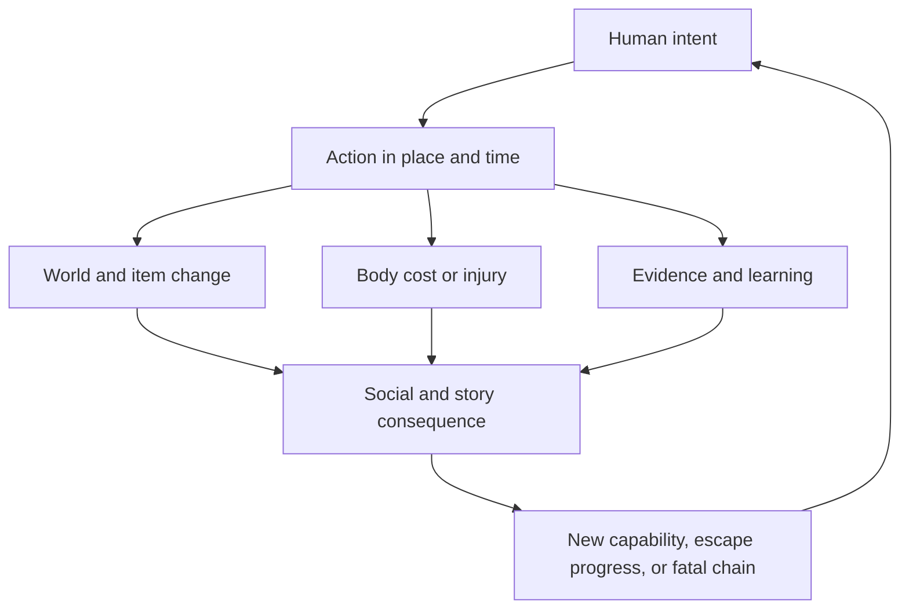

# THE FIRST NIGHT — One Life on the Living Island

**Unified Survival Game Master Specification v0.7 — 26 July 2026**

**Project:** THE FIRST NIGHT

**Internal codename:** DRIFT

**Engine and target:** Godot 4.x; first-person 3D; web and Android

**Setting:** An open-world Bermuda Triangle island accumulating people,
wreckage, knowledge, and technology from incompatible eras

**Status:** Authoritative future-gameplay constitution. This document
integrates the six preceding design documents into one playable system. It
does not authorize gameplay expansion before the v0.1.2 interaction-recovery
build passes the Director's physical-device test.

---

## 1. Executive ruling

THE FIRST NIGHT is a one-life human survival game about what a person becomes
when an impossible island refuses to let them leave.

The player's complete arc is:

> **Survive the arrival → make the first night survivable → turn survival into
> repeatable life → recover capability from nature and wreckage → learn,
> specialize, cooperate, compete, or betray → prove a credible way home →
> escape alive or die.**

There are only two terminal outcomes for a character:

1. **Escape:** the character reaches credible outside-world contact or a
   verified terminal destination. Their run ends and its human consequences
   are recorded.
2. **Death:** a terminal bodily mechanism is resolved through the common
   mortality engine. That character is permanently dead.

The binding promise is:

> **If you die, you die. The game does not resurrect you. The world remembers
> that you lived.**

Permanent death does not justify arbitrary cruelty. It makes causality,
perception, preparation, rescue, workmanship, and trust more important.
Common dangers must warn and escalate. Catastrophic dangers may kill quickly,
but their conditions must be real and traceable. Once death is terminally
committed, there is no revive, save reload, rollback, premium recovery,
teammate resurrection, or successor who inherits the dead person's mind.

THE FIRST NIGHT is not a generic recipe game and not merely “Rust on a tropical
island.” Its distinctive fantasy is:

> **Nature sustains life. Wreckage accelerates capability. Infrastructure
> transforms labor. Knowledge reveals possibilities. Experience improves
> judgment and execution. Relationships multiply or corrupt human effort.
> Anomalies bend normal rules at a cost.**

The island is simultaneously:

- a living ecology;
- a finite material inheritance;
- a dangerous workshop;
- a social history;
- a graveyard of failed decisions;
- a school without a curriculum;
- and a collection of possible roads home.

## 2. Canon authority and reconciliation

The six source documents are cumulative rather than six parallel rulebooks.
Their authority is consolidated as follows.

| Source | Lasting contribution | v0.7 ruling |
|---|---|---|
| Island Crafting Ecology v0.1 | Wreck-fed economy, material eras, source maps, craft families, social ownership, first slice | Historical foundation; all surviving rules are incorporated |
| Island Crafting Ecology v0.2 | Practice, study, teaching, quality, efficiency, creativity, innovation | Incorporated into the unified mastery engine |
| Island Crafting Ecology v0.3 | Capability graph, learning events, object states, substitution, correlated chains | Incorporated into the action and content graph |
| Island Crafting Ecology v0.4 | Embodied inventory, backpack hotkeys, finite geology, cultivation, work/recovery, Kenshi-inspired development, Blender pipeline | Incorporated and retained |
| Human Survival Master Spec v0.5 | Identity, body, action ledger, human time/place, 200 mortality archetypes, timber chain, escape gates | Retained as the detailed human/material and general-mortality catalog |
| Return-Home Master Spec v0.6 | 42 swim routes, 72 watercraft, 32 endings, 96 ending deaths, full reverse chains | Retained as the detailed maritime and return-home catalog |

This v0.7 document is authoritative when the sources overlap. The detailed
catalogs remain imported by reference:

- general fatal archetypes **D001–D200** are the numbered 1–200 mortality
  library in v0.5;
- swim-enabled routes **S01–S42** remain exactly as authored in v0.6;
- watercraft plans **C01–C72** remain exactly as authored in v0.6;
- return-home programs **E01–E32** remain exactly as authored in v0.6;
- ending-specific fatal chains **F01–F96** remain exactly as authored in v0.6.

### 2.1 Resolved ambiguities

1. **One life:** “If you die, you die” means irreversible character death.
   Incapacitation and crisis are not death; rescue remains possible until the
   terminal mechanism becomes irreversible.
2. **Legacy:** the persistent world is the meta-progression. Structures,
   altered landscapes, depleted deposits, crops, plans, teaching, witnesses,
   debts, evidence, bodies, and possessions may outlive their maker.
3. **New character:** a later character is a new human with a new body,
   background, arrival, and knowledge state. They do not inherit the former
   character's mastery, map, memories, relationships, or private markers.
4. **Capability tiers:** Tier 0–4 labels describe content horizons for authors.
   Players never buy or reach “Tier 3.”
5. **First ecology slice:** the canonical slice contains **14 visible outputs**:
   stone cutter, cordage, salvage pry tool, rain catcher, boiling setup, water
   pre-filter, patch/sealant, reinforced shelter panel, bedroll, drying rack,
   storage crate, hand sled/cart, noise alarm, and radio receiver. The older
   “12 outputs” limit is retired rather than hiding real transformations.
6. **Priority order:** after airway, catastrophic bleeding, fire, submersion,
   crush, and similar immediate threats, the player addresses the most urgent
   exposure need. Fire, shelter, and water are contextual; food is normally
   later. “Fire → Shelter → Water → Food” is a memory aid, not an inflexible
   command.
7. **Swimming:** exceptional strength, stamina, and swimming expand operations.
   They never enable an ordinary transoceanic swim.
8. **Solo and social play:** no ending or basic survival function requires
   another human player. Cooperation improves scale, time, observation,
   rescue, specialization, watchkeeping, and resilience.
9. **Sabotage:** hostile acts modify physical objects, systems, access,
   information, or relationships. They never apply an invisible health or
   quality penalty.
10. **Offline life:** an absent protected character cannot silently enter
    crisis or die. Offline systems may consume, produce, grow, spoil, weather,
    and retain evidence within bounded rules.

## 3. The design constitution

Every feature must honor these laws.

### Law 1 — One action, many truthful consequences

Every meaningful action may affect the world, body, equipment, competence,
relationships, story, and fate. It changes only the channels causally involved.

### Law 2 — The world, not XP, is the progression interface

New capability comes from places, materials, tools, workstations, knowledge,
practice, teachers, tests, and human readiness. A number never replaces a
missing physical requirement.

### Law 3 — Mastery improves perception before speed

Progression normally improves:

> **Perception → safety and judgment → quality → efficiency → creativity**

Veterans notice more, choose better, waste less, diagnose earlier, and design
adaptations. They do not become immune to gravity, poison, heat, blood loss,
weather, fire, electricity, or material failure.

### Law 4 — Survival is causal and legible

The player should understand what threatens them, what changed, what can still
be done, and why an outcome occurred. Hidden simulation may create uncertainty;
it may not create arbitrary punishment.

### Law 5 — Power creates new obligations

Every capability replaces one vulnerability with a stronger but maintainable
system. Fire brings smoke and spread. A shelter brings collapse and
ventilation risk. Electricity brings shock, fire, corrosion, and dependency.
A vessel brings stability, navigation, maintenance, and human-command risk.

### Law 6 — Materials retain identity

A battery is not “electronics.” A valve is not “metal.” A black box is not
“scrap.” Provenance, form, condition, function, workmanship, defects, and
knowledge payload matter.

### Law 7 — Cooperation is valuable, never compulsory

Two people may carry, brace, watch, rescue, inspect, teach, or work in
parallel. A solo player substitutes time, smaller loads, jigs, carts, pulleys,
automation, manuals, redundancy, conservative routes, and a smaller project.

### Law 8 — Betrayal is possible and answerable

Theft, misinformation, poisoning, tampering, violence, and exclusion are
possible. Important hostile actions require access, time, tools, risk, and
intent. They leave evidence and usually permit prevention, detection, repair,
retaliation, or social judgment.

### Law 9 — Death is final, but rarely meaningless

Death terminates the character. It also creates a causal record, physical
evidence, changed relationships, possessions, unfinished promises, and lessons
that may survive in the world.

### Law 10 — Escape is a program

No final item completes the game. Every ending requires a destination or
detection path, system integrity, human readiness, sustainment, a viable
window, authority and consent where relevant, tests, fallback, and the final
journey.

### Law 11 — Depth must produce enjoyment, not administration

The game simulates variables only when they change a decision, sensation,
relationship, plan, or story. Common mastered work compresses. Novel,
dangerous, social, or diagnostic work remains playable.

## 4. The unified causality engine

The game is one simulation expressed through seven connected ledgers.



### 4.1 The seven ledgers

| Ledger | What it owns | Examples |
|---|---|---|
| World | Time, weather, tide, ecology, sites, fire, water, wrecks, structures, deposits, crops, anomaly | A cave floods; a storm beaches debris; an outcrop remains depleted |
| Human | Identity, life functions, needs, readiness, wounds, illness, adaptation, burdens, motives | Thirst increases; a hand loses grip; grief changes sleep |
| Possession | Hands, worn equipment, backpack, storage, installed parts, mass, bulk, access, ownership | The canteen is on the belt; the battery is on a sled |
| Capability | Material properties, tools, workstations, plans, components, finished systems, tested limits | A valve controls flow; a hoist has a known safe load |
| Mastery | Domain proficiency, technique, material familiarity, principles, confidence, responsibility, authored designs | The player recognizes salt-corroded wiring and can explain the fault |
| Social | Relationships, trust, promises, permissions, contracts, contributions, witnesses, reputation evidence, tampering | A person remembers abandonment; a tank seal records interference |
| Fate | Hazard chains, rescue windows, mortality, escape gates, endings, legacy | A wet bed becomes hypothermia risk; a radio opens E03 |

No ledger may independently invent a result that belongs to another. Mastery
cannot refill hydration. A social permission cannot make a wall indestructible.
A recipe cannot remove a wound. An ending cannot bypass craft or body proof.

### 4.2 Canonical variable registry

#### World context

- world time, elapsed time, day, season, daylight, visibility;
- air and water temperature, humidity, shade, wind, rain, lightning, storms;
- tide height and direction, currents, surf, swell, sea state, water depth;
- fire, smoke, fuel vapor, flooding, contamination, gas, collapse, noise;
- biome, terrain, slope, footing, route, distance, exits, nearby refuge;
- living populations, regeneration pressure, harvest history, overuse;
- wreck integrity, compartment state, corrosion, prior contents, moving loads;
- finite deposit reserve, grade, hazards, tailings, extraction history;
- crop/plant stage, soil, moisture, salt, pests, disease, lineage;
- anomaly phase, field strength, instrument disagreement, displaced objects;
- ownership, witnesses, traffic, nearby actors, active projects and conflicts.

#### Human identity

- age band, body frame, dominant hand, prior conditioning, movement limits;
- chronic conditions, allergies, medication dependence, old injuries, scars;
- life-before-island background, languages, literacy, prior principles and
  techniques;
- arrival injury and exposure;
- motives, attachments, fears, obligations, people they will or will not
  abandon;
- relationships, trust, debt, promises, grief, witnessed acts and reputation;
- authored plans, major creations, discoveries, students and teachers.

#### Life functions

- airway and breathing;
- circulation and blood;
- brain function and consciousness;
- core temperature;
- water and electrolytes;
- available metabolic energy.

#### Player-facing readiness

- health;
- hunger and nutrition trajectory;
- thirst and hydration;
- energy and sleep pressure;
- warmth/thermal state, including overheating;
- stamina;
- sleep debt, pain, carried load, fear/stress, balance and dexterity.

#### Long-term adaptation and burden

- strength;
- endurance/work capacity;
- mobility and balance;
- acclimatization;
- general health/resilience;
- wounds, fractures, burns, infection, illness and impairment;
- recovery debt, overuse, chronic burden and compensatory movement.

#### Item and construction state

- base identity and definition;
- material family and functional capability tags;
- form, dimensions, scale, mass, bulk and grip;
- provenance, age and exact important source;
- integrity, sharpness, charge, contamination, corrosion, wetness,
  calibration, spoilage or pressure as relevant;
- useful traits and liabilities;
- workmanship by operation;
- maker, owner, contributors, repairs, inspections and alteration history;
- visible, discoverable and latent defects;
- knowledge payload, markings, labels, serials, recordings and clues;
- current physical location and access state;
- wear mode, maintenance requirement, repair route and recoverable end state.

#### Competence

- broad domain proficiency;
- technique familiarity;
- material familiarity;
- principle knowledge;
- current confidence and rust;
- demonstrated responsibility and verified tests;
- known patterns, annotations, jigs, gauges, prototypes and inventions;
- ability to teach, diagnose and compare evidence.

#### Social state

- personal, shared, public, restricted, claimed or contested ownership;
- container, construction, project and critical-system permissions;
- contribution, withdrawal, maintenance and tamper evidence;
- trade, contract, debt, promise, consent and command;
- witnessed rescue, abandonment, theft, violence, teaching and deception;
- local reputation based on evidence rather than a global morality score.

#### Hazard and fate state

- initiating source and affected target;
- cues, exposure route, intensity, duration and accumulated dose;
- protections, their condition and their limits;
- impairment stage and response window;
- possible rescue and treatment;
- terminal mechanism;
- escape project, route, proof, destination, window, crew, stores, authority,
  sabotage check, fallback and legacy.

### 4.3 The mandatory human questions

Every item, action, hazard, encounter, project, death and ending must answer:

| Question | Required answer |
|---|---|
| What? | Concrete target, operation, inputs, outputs, condition and possible failure |
| When? | Time, tide, weather, light, body readiness, urgency and opportunity window |
| Where? | Terrain, site, route, distance, exits, ownership, witnesses and nearby hazards |
| Why? | Need, motive, pressure and accepted trade-off |
| Who? | Actor, body, knowledge, tools, helpers, dependents, owners, witnesses and opponents |
| How? | Sequence, method, protection, workload, warning, response, test and evidence |

Content that cannot answer all six is not ready.

### 4.4 The fifteen-axis feature completion test

Every important object or activity must connect to the full game through the
relevant axes:

1. material;
2. function;
3. tool/process;
4. location;
5. time and renewal;
6. social use;
7. narrative meaning;
8. mastery;
9. possession/access;
10. embodied cost;
11. intent;
12. temporal context;
13. hazard;
14. identity and responsibility;
15. fate and ending contribution.

Not every axis needs a large mechanic. Every axis needs an authored answer or a
deliberate “not applicable.” This prevents a material from becoming an orphan,
a skill from becoming a grind bar, or a death from becoming an isolated trap.

### 4.5 The action event

Every meaningful player, NPC, automated, environmental, and social action
resolves through the same event structure:

1. **Need and intent:** What is the actor trying to achieve, and why now?
2. **Actor:** Which body, injuries, readiness, load, competence, motives and
   recent work enter the attempt?
3. **Context:** Where and when is it happening? What do weather, tide, light,
   terrain, ownership, witnesses and active hazards change?
4. **Method:** Which sequence, pace, tool, grip, stance, protection, helper,
   plan and workstation are used?
5. **Capability match:** Do the material, form, tool and component functions
   satisfy the job?
6. **Work demand:** What stamina, hydration, energy, nutrition, heat,
   attention, time and tool condition are spent?
7. **Hazard dose:** What harmful exposure occurs after protection and response?
8. **Immediate result:** What moved, transformed, broke, spilled, signaled,
   healed, contaminated, sounded or became accessible?
9. **Residue:** What fatigue, wetness, waste, offcut, loosened part, wound,
   suspicion, clue or maintenance debt remains?
10. **Test and feedback:** Was the result loaded, tasted, observed, inspected,
    used in weather, compared, or reviewed?
11. **Delayed result:** What heals, adapts, spoils, corrodes, grows, infects,
    collapses, earns trust, triggers retaliation or creates an idea?
12. **Fate contribution:** Did it preserve life, reduce options, open a route,
    rescue someone, create an escape dependency or advance a fatal chain?

No action directly says “-5 health” or “+10 skill.” Health changes because
tissue, circulation, temperature, infection, toxin, oxygen or another body
mechanism changed. Mastery changes because useful evidence was acquired and
processed.

### 4.6 Conceptual resolution relations

These relations guide implementation; their coefficients are `[TUNE]`.

`effective action = capability match × readiness × competence × method ×
equipment condition × assistance × environmental fit`

`workload = intensity × duration × carried/handled load × tool inefficiency ×
terrain/environment`

`hazard dose = source intensity × exposure time × route/contact × exertion −
effective protection − timely response`

`learning = task value × challenge fit × novelty × feedback × responsibility ×
instruction × reflection`

`realized adaptation = appropriate stimulus × recovery quality × nutrition ×
hydration × sleep × remaining growth potential`

`craft result = material fitness × execution × principle coverage × tool and
workspace fitness × care × environmental control − defects`

Multiplication here means that a critically weak relationship constrains the
whole outcome. It is not a promise that every variable is displayed as a
percentage.

### 4.7 Worked integration: one tree

Felling one tree can:

1. remove a slow-renewing living organism and alter shade, habitat and future
   regeneration;
2. consume travel time, hydration and route knowledge before work begins;
3. create forestry evidence through species, lean, rot, crown, wind and escape
   inspection;
4. require a reachable, suitable, maintained edge;
5. create workload, heat, noise, tool wear and falling-object risk;
6. produce a stump, canopy opening, logs, limbs, leaves, bark, chips and
   possible damage;
7. create felling, fine-motor, material and safety evidence;
8. require bucking, leverage, transport, storage, seasoning and grading;
9. become poles, beams, boards, planks, battens, pegs, handles, shavings,
   charcoal stock and repairs;
10. feed shelter, furniture, machines, bridges, carts and watercraft through
    different competencies;
11. become a trade asset, disputed property, public-project contribution,
    stolen stock or forensic evidence;
12. eventually preserve life, fail under load, support an ending, or become a
    link in a death.

Chopping never directly teaches naval construction. The full path remains:

> **Forestry → felling → tool control → timber conversion → joinery →
> structural construction / furniture / machines / naval construction**

### 4.8 Worked integration: one aircraft battery

The battery is:

- heavy, finite, corrosive, degradable and capable of high current;
- reachable only through a route and safe wreck operation;
- carried quickly by two people, slowly by a sled, or sacrificed by
  dismantling;
- usable for radio, lights, alarm, refrigeration, ignition, electric transport
  or anomaly research;
- a source of electrical learning, chemical hazard, logistics, conflict,
  maintenance and story;
- drainable, stealable or alterable by a saboteur, with voltage, seal, serial,
  terminal and tool-mark evidence;
- capable of opening rescue and escape routes;
- capable of causing burns, fire, toxic exposure, shock, or a failed ending
  when mishandled.

There is no abstract “best use.” The decision depends on body, weather,
relationships, available alternatives, knowledge, and desired way home.

## 5. The human survival model

### 5.1 The person is not six bars

The interface may summarize health, hunger, thirst, energy, warmth and stamina,
but the simulation distinguishes their causes and time scales.

| State | Dominant time scale | Function |
|---|---|---|
| Health | Seconds to weeks | Actual injury, illness and tissue/body function |
| Hunger | Hours to days | Satiety and nutritional trajectory |
| Thirst | Minutes to days | Hydration/electrolyte need |
| Energy | Hours to days | Wakefulness, sleep pressure and recovery readiness |
| Warmth | Minutes to hours | Cold, comfort, heat and dangerous thermal strain |
| Stamina | Seconds to minutes | Immediate intense-action reserve |

Safe labor primarily spends stamina, hydration and energy, creates delayed
nutrition demand, generates heat, and adds recovery debt. It does not subtract
health merely because it is tiring. Health changes when the work causes
injury, toxic exposure, thermal strain, infection, oxygen failure or another
real mechanism.

### 5.2 Readiness changes behavior before collapse

Declining readiness appears progressively:

- breathing cadence and vocal effort;
- slower or less accurate tool animation;
- tremor, grip changes and aim drift;
- posture, balance and stumbling;
- delayed interaction and poor sequencing;
- reduced awareness and broader uncertainty;
- shorter, more irritable communication;
- visible wound compensation;
- explicit plain-language warnings.

The character may still choose to continue. The game does not secretly replace
their choice with a random refusal. It makes the cost and narrowing safety
margin perceptible.

### 5.3 Work, recovery and adaptation

Appropriate varied work creates a potential physical stimulus. The body
realizes it during later recovery.

Examples:

| Activity | Immediate cost | Technique/mastery | Possible adaptation after recovery | Mismanagement burden |
|---|---|---|---|---|
| Hammer mining | Stamina, thirst, energy, heat, tool wear | Strike, fracture, ore sorting | Strength, coordination, work capacity | Fragment injury, dust, strain, collapse |
| Felling/sawing | Stamina, hydration, attention | Tree reading, edge and cut control | Strength and endurance | Cuts, falling timber, overuse |
| Forging | Very high heat/thirst, energy, fuel | Heat, hammer, shape and finish | Grip and work capacity, bounded acclimatization | Burns, fumes, hearing/eye injury, heat illness |
| Heavy hauling | Load, stamina, balance, thirst | Packing, rigging, route and teamwork | Strength, balance, endurance | Falls and joint/back injury |
| Gardening | Time, moderate heat/thirst | Soil, plant, moisture and diagnosis | Mobility and light conditioning | Infection, sun, poison and crop loss |
| Swimming | Stamina, thermal load and reserve | Breath, stroke, sighting and water judgment | Water-specific endurance and confidence | Drowning, current loss, cuts and hypothermia |
| Study | Energy, attention and safe time | Principles and planning | No muscle adaptation | False confidence or distraction |
| Combat | Extreme demand and body risk | Awareness, weapon and defense | Safe training may condition; injury is not benefit | Wounds, infection, disability and death |

The optimal progression path is not self-destruction. Dehydrated overwork
reduces control, feedback processing, quality and recovery. Collapse,
intentional injury and repetitive abuse are poor training strategies.

### 5.4 Injury and illness change the whole life

A condition records location, mechanism, severity, contamination, pain,
function, treatment and progression. Its consequences propagate.

A right-hand laceration may:

- weaken grip and make a hot tool unsafe;
- slow bandaging another person;
- force left-hand technique;
- change which items can be drawn from belt or backpack;
- delay construction;
- make swimming and reboarding dangerous;
- allow infection;
- change a departure role from rower to navigator;
- become chronic impairment;
- or begin a fatal chain.

Treatment is not an instant status cleanse. Bleeding control, cleaning,
closure, immobilization, pain management, monitoring, nutrition, hydration and
time solve different parts of the problem.

### 5.5 Mental life without a “sanity meter”

The game models fear, stress, grief, hope, confidence, trust, sleep and
attention as human pressures.

- Fear can speed immediate action while narrowing perception.
- Familiarity and rehearsal improve composure in known situations.
- Isolation removes shared observation, rescue and reality checking.
- Grief changes sleep, appetite, willingness to risk and relationships.
- Betrayal changes evidence thresholds and cooperation.
- Credible progress—safe water, a recovering patient, a crop sprout, a clear
  voice on the radio, a tested hull—creates hope.

No hidden morality or insanity score forces random behavior. Procedural
self-harm is never a craft, skill, spectacle, loot source or competitive
strategy. **End Journey** may close a run non-graphically and without reward.

## 6. The permanent-death constitution

### 6.1 Alive, impaired, critical and dead are different

The common hazard chain is:

> **Cue → exposure → impairment → crisis → terminal mechanism**

A player may be unconscious, trapped, bleeding severely, hypothermic,
poisoned, drowning, shocked or otherwise critical while still alive.
Self-rescue or another person's intervention may still work. There is no
universal “downed timer”; each crisis has its own airway, blood, temperature,
toxin, pressure, fire, structural or neurological window.

Death occurs only when a terminal mechanism becomes irreversible:

- respiratory failure;
- circulatory collapse;
- irreversible neurological injury;
- lethal thermal failure;
- terminal infectious, toxic or metabolic failure;
- catastrophic trauma incompatible with continued life.

### 6.2 The death commit

Terminal death is a server-authoritative atomic event:

1. resolve the final body state;
2. record initiating event and causal contributors;
3. preserve relevant item, weather, workmanship, witness and tamper evidence;
4. mark the character identity permanently dead;
5. stop all character-controlled actions and progression;
6. persist body, carried possessions and world effects under the world's
   recovery and decay rules;
7. generate the causal death review and legacy entry.

After this commit:

- no item, teammate, timer, currency, advertisement or menu revives the person;
- reloading restores the death record, not the living state;
- a crash recovery replays or rolls back only to the last fully committed
  transaction and may never duplicate a life;
- testing tools may exist in development builds but are absent from production
  play.

The production save is one authoritative run branch with continuous
transactional persistence. Players may pause, exit and resume; they may not
select an earlier checkpoint to erase a wound, failed craft, theft, death or
ending. Operational snapshots exist only for corruption/disaster recovery and
must preserve the latest valid committed character fate.

### 6.3 Fairness required by one life

Strict death requires stricter fairness:

- common hazards have readable cues and response opportunities;
- instant death is limited to overwhelming events with traceable conditions;
- skill reveals danger and uncertainty rather than creating immunity;
- routine actions do not hide lottery-style lethality;
- a technical input lock, viewport error, dropped connection, corrupt save or
  server fault may never be accepted as an in-world cause of permanent death;
- new arrivals gain control before the world can harm them and do not appear
  inside another player's active attack;
- rescue usually requires action, equipment, access and time, not a magic
  revive interaction;
- a player may retreat, abandon property, surrender, call for help or postpone
  a project.

### 6.4 PvP under permanent death

Violence is possible, including lethal violence. It is not frictionless.

- Most non-catastrophic hits cause location-specific wounds and impairment,
  creating opportunities to flee, treat, surrender, capture, rescue or finish
  the attack.
- Deliberately killing a helpless person is a distinct witnessed action, not
  an accidental extension of looting.
- Blood, projectiles, weapon damage, tracks, witnesses, radio traffic, missing
  property and body evidence can reconstruct events.
- Armor and defenses change dose and access; they never create invulnerability.
- Repeated fresh-arrival hunting is prevented through spawn separation,
  control readiness and server conduct rules rather than magical lifelong
  safety.
- Reputation remains factual and local: witnessed attacks, bodies, theft
  reports, fulfilled contracts and rescues.

### 6.5 Offline and connection safety

A deliberate protected logout requires a short, uninterrupted safe-exit
procedure outside active combat, water, fire, machinery, structural movement
and medical crisis.

While protected offline:

- the person cannot die or enter crisis;
- they do not train, innovate, explore, fight or secretly produce high-value
  mastery;
- crops, ordinary machines, stored resources, spoilage, corrosion and weather
  may reconcile within bounded authored limits;
- the physical camp may still exist in the shared world, and other players may
  interact with property under the normal access/evidence rules;
- no invisible offline poisoning, body harm or total base erasure is allowed.

An unexpected disconnect outside safe-exit conditions enters a nonrewarding
technical suspension rather than an in-world death. It grants no movement,
healing, escape, loot protection exploit or progress. The unresolved situation
is restored as fairly as possible on reconnection. Abuse prevention must never
use permanent death as punishment for unreliable hardware or networking.

### 6.6 What survives a dead character

The world may retain:

- the body and recoverable possessions;
- structures, crops, machines, caches and altered routes;
- depleted geology and harvested ecology;
- authored plans, annotations, jigs and named inventions;
- lessons taught to living people;
- memories, relationships, debts, promises and grudges;
- records, radio logs, manifests, cause-of-death evidence and memorials;
- unfinished escape projects and defects;
- consequences of rescue, theft, violence and sabotage.

A later character can discover or be taught these things through the world.
They do not receive them because the same human player controls both
characters.

### 6.7 Re-entry after death

The dead character's run is over. The player may:

- inspect the causal archive;
- observe the persistent world where server rules permit;
- begin a later arrival as a different person;
- or begin a new island.

A new arrival:

- starts from their own naked minute;
- has an independent background, body and motives;
- has no magical location marker for the former body or camp;
- cannot read private memories or plans that were never externalized;
- may encounter a world already changed by previous lives;
- cannot immediately revenge-cycle through repeated disposable characters.

The island is persistent history, not a reincarnation machine.

## 7. The living island

### 7.1 A place made from four material eras

| Era | Sources | Mechanical contribution | Narrative contribution |
|---|---|---|---|
| Living island | Forest, reef, beach, cave, mangrove, weather, animals and plants | Renewable survival, timber, fiber, stone, clay, food, medicine, resin | The normal world still operates |
| Old wrecks | Sailing ships, steam vessels, wartime craft | Hardwood, canvas, rope, iron, brass, glass, hand mechanisms and charts | The island has been taking people for generations |
| Modern wrecks | Airliners, freighters, yachts, helicopters | Aluminum, steel, polymers, batteries, wiring, medicine, motors, fuel and electronics | Contemporary evidence and rapid technical acceleration |
| Impossible wrecks | Unregistered, future, displaced or altered craft | Phase glass, magnetized alloy, cold cells, shielding and temporal records | The Triangle is a system, not decorative lore |

These are not cosmetic loot themes. Their materials have different forms,
joining methods, hazards, maintenance needs and knowledge.

### 7.2 Geography is a risk–capability network

| Region | Immediate promise | Distinctive danger | Capability it teaches or rewards |
|---|---|---|---|
| Active crash beach | People, emergency gear, beacon, obvious debris | Fire, fuel, surf, tide, sharp and moving wreckage | Triage, signaling, first judgment |
| Open beach/dunes | Driftwood, visibility, shell, landing and signal space | Heat, lightning, surge, little water | Weather, tide, shade, lookout |
| Lagoon/reef | Fish, coral passages, shallow salvage, current evidence | Drowning, breakers, cuts, venom and infection | Swimming, fishing, craft trials |
| Mangrove/wetland | Fiber, clay, plants, sheltered waterways | Mud, tide, insects, contaminated water and ambush | Ecology, route marking and hygiene |
| Treeline/forest | Timber, shade, fruit, medicine and game | Falling timber, fire, poison, animals and navigation | Forestry, cultivation and shelter |
| Highlands/cliffs | Stone, weather view, radio line of sight | Falls, lightning, exposure, rockfall and hauling | Rigging, forecasting and towers |
| Caves/sinkholes | Minerals, cool storage, water clues and old evidence | Flood, bad air, collapse, darkness and anomaly | Geology, ventilation and rope systems |
| Old shipwreck | Planks, canvas, rope, brass, iron, charts and mechanisms | Rot, corrosion, tide, confinement and coatings | Rigging, mechanics and ship knowledge |
| Modern aircraft field | Webbing, aluminum, medicine, battery, avionics and identity | Fuel, live circuits, sharp composite and instability | Airframe, electrical and radio |
| Modern vessel wreck | Steel, pumps, engines, refrigeration, cargo and fuel | Gas, flooding, pressure, explosion and heavy loads | Industrial repair and infrastructure |
| Storm scar/impossible zone | Rare evidence and anomaly capability | Measured but unfamiliar field effects | Instrumentation, comparison and endgame research |

Distance, return path, carried mass, darkness, weather window, companion
condition and alternate exit are part of every resource's real cost.

### 7.3 Time is an active system

The world clock governs:

- tide, exposed wreck compartments, caves, reef passes and beach safety;
- wind, sailing, fire spread, tree fall, radio masts and thermal load;
- rain, catchment, flooding, rot, contamination, electrical danger and crops;
- daylight, visibility, precision, navigation, watch and security;
- spoilage, corrosion, wetness, drying, curing and fuel degradation;
- healing, infection, sleep, recovery and physical adaptation;
- germination, plant growth, flowering, pollination and seed formation;
- maintenance debt and structural fatigue;
- storms, new drift salvage and island shifts;
- rescue, radio, vessel and anomaly windows.

The player learns rhythms rather than waiting for arbitrary cooldowns.

### 7.4 Ecological renewal and permanent scarcity

Every source belongs to one renewal class:

| Class | Examples | Rule |
|---|---|---|
| Renewable | Rain, many plants, small animals, fish | Returns through an ecology affected by local pressure |
| Slow-renewing | Hardwood, medicinal plants, large animals | Overuse produces persistent local scarcity |
| Event-renewed | Drift cargo, loose wreck fragments | New supply follows authored storms or displacement events |
| Finite per wreck | Batteries, medicine, electronics, tools, fuel | Never regenerates inside the same wreck |
| Repairable | Pumps, engines, radios and machinery | Persists through maintenance, parts and condition |
| Unique knowledge | Recorders, charts, diagrams and logs | Can be decoded, copied, annotated, stolen or destroyed |
| Anomaly-cycled | Rare displaced matter | May reappear through nonfarmable shifts with risk |

Renewable basics prevent survival hard locks. Finite high-value capability
drives exploration, trade, conservation, theft and conflict.

### 7.5 Finite geology is conserved

Every stone, metal and sulfur deposit has an original reserve. A completely
harvested deposit never respawns.

`reserve removed = usable material + recoverable tailings + irrecoverable loss`

Mastery changes the split by improving site reading, tool choice, fracture
control and sorting. It never creates geological mass.

When a deposit reaches zero:

- exhausted geometry, marks, ownership and extraction history persist;
- surveys report depletion;
- later equipment may reprocess tailings;
- a separately modeled deeper seam may be discovered;
- storms may expose loose material elsewhere;
- reload, distance, time and server restart never restore that node.

Finite geology creates meaningful surveying, recycling, stockpiling, hauling,
territory and historical landscape change.

### 7.6 Cultivation is inherited causality

Fruit consumption can yield a seed lot. A seed lot records species, source,
apparent condition, maturity, damage, salt, mold, heat, age, storage and latent
viability. A planted outcome cannot be rerolled through reconnecting.

Growth is a chain:

> **Recovery → preparation → sowing → germination → seedling → establishment →
> maturity → flowering/pollination → fruit and new seed**

Each stage has distinct soil, moisture, temperature, light, protection and
timing needs. Gardening experience improves observation and control:

- careful seed recovery;
- viability and disease recognition;
- dormancy treatment;
- site, drainage, shade and depth selection;
- moisture judgment;
- protection from salt, pests, trampling and storms;
- thinning, transplanting, pruning, grafting and pollination;
- failure diagnosis and seed selection.

Expertise never turns a sterile seed fertile. It increases the chance that the
player recognizes the truth early and creates the right conditions for viable
material.

A successful named seed line becomes food, medicine, shade, knowledge, trade,
inheritance and social territory.

### 7.7 Fire, water, food and shelter form one ecology

These systems are interdependent:

- Shelter changes warmth, wetness, sleep, fire ventilation, water collection,
  storage safety, medical hygiene and work quality.
- Fire changes warmth, water treatment, food safety, smoke, visibility, fuel,
  material processing and wildfire risk.
- Water changes hydration, medicine, cooking, hygiene, crops, fire control,
  industry and disease.
- Food changes available energy, recovery, healing, strength retention, voyage
  endurance and social dependence.
- Sanitation changes water, food, wounds, insects and settlement health.

No single bar represents this network. A dry, ventilated shelter with a clean
water routine can be more valuable than a larger fortified structure.

## 8. Materials, items and crafting

### 8.1 Material families

| Family | Important forms | Repeated roles |
|---|---|---|
| Timber | Log, pole, beam, board, plank, peg, handle, charcoal | Shelter, tools, fuel, storage, machines and boats |
| Fiber/textile | Plant fiber, cordage, cloth, canvas, webbing, mat | Binding, clothing, filters, sails, bandages and packs |
| Stone/mineral | Stone, flint, clay, sand, gravel, lime, sulfur, ore | Primitive edges, hearth, ceramic, masonry, filter and industry |
| Organic | Food, bone, shell, hide, fat, resin, sap, medicine | Nutrition, tools, treatment, adhesive, seal and light |
| Ferrous metal | Iron, steel, chain, plate, rod and fastener | Strong tools, structure, machinery, defense and heat systems |
| Non-ferrous metal | Aluminum, copper, brass and alloys | Light structure, electricity, plumbing, signal and fittings |
| Polymer/rubber | Raft fabric, hose, tire, seal and insulation | Waterproofing, flotation, gaskets, containers and electrical safety |
| Glass/optics | Bottle, pane, mirror, lens and gauge | Storage, signaling, greenhouse, observation and instruments |
| Chemical | Fuel, oil, alcohol, agents, battery chemistry | Fire, preservation, lubrication, power and hazardous processing |
| Electrical/electronic | Cell, wire, connector, motor, circuit, sensor and radio core | Light, alarm, power, communication, navigation and anomaly research |

### 8.2 Functional capabilities

Recipes and projects use a restrained capability vocabulary:

- structure: rigidity, tension, compression, toughness;
- barrier: water resistance, sealing, filtration, opacity and ventilation;
- thermal/fire: insulation, heat tolerance, flammability and thermal mass;
- electrical: conductivity, insulation, charge and signal behavior;
- fluid/pressure: capacity, flow, sealing and pressure tolerance;
- chemical/biological: sterility, absorbency, reactivity, toxicity and
  preservation;
- precision: calibration, accuracy, edge retention and dimensional stability;
- logistics: mass, bulk, portability, buoyancy, stackability and grip.

If a property never changes a player decision, it is not simulated.

### 8.3 Recipe grammar

A design can ask for:

1. an identity-critical component;
2. a capability;
3. a required form and scale;
4. a process consumable;
5. a tool or workstation operation;
6. principle coverage and practical confidence.

This permits real substitution.

| Need | Strong answer | Viable answer | Emergency answer | Difference |
|---|---|---|---|---|
| Waterproof sheet | Raft fabric | Pitch-treated canvas | Layered palm mat | Capacity, labor, leakage and maintenance |
| Strong binding | Ship rope/webbing | Good natural cordage | Green vine | Stretch, rot, shock and inspection interval |
| Light rigid frame | Aircraft tube | Hardwood pole | Graded driftwood | Weight, joining, lifespan and storm behavior |
| Flow control | Brass valve | Hose clamp | Tied reed outlet | Hygiene, precision and leakage |
| Conductor | Insulated copper | Protected bare copper | Steel wire | Loss, corrosion, heat and fire risk |

A substitute must change a meaningful trait, process, risk, appearance or
maintenance burden. It is never a silent color swap.

### 8.4 Selective dismantling

Distinctive components remain valuable in their original function.

- A valve may stay a valve, donate seals/fittings, or become brass stock.
- A battery may stay storage, be rebuilt, yield cells and terminals, or become
  hazardous waste.
- A pulley may stay mechanical advantage, donate a wheel/bearing, or eventually
  become metal stock.
- A recorder may be decoded, protected as evidence, used as a hardened
  enclosure, or destroyed for components after an explicit warning.

Careful inspection and disassembly should usually preserve more capability than
brute destruction.

### 8.5 The closed item lifecycle

> **Discover → inspect → acquire → process → build/repair → use → wear/fail →
> diagnose → maintain/adapt → recover**

A broken durable item does not vanish at zero durability. An axe may leave a
head, handle, binding, fragments and failure evidence. A failed structure
leaves components and debris according to the failure. Consumables disappear
only because their physical function consumes or transforms them.

Every durable item requires:

- a use loop;
- condition and wear;
- readable failure clues;
- repair and maintenance;
- recoverable end state;
- at least one adaptation or downstream relationship.

### 8.6 Crafting horizons

These are content horizons, not player levels.

| Horizon | Player problem | Typical capability |
|---|---|---|
| Emergency improvisation | Live through the next minutes/hours | Edge, cordage, tinder, signal, leaf cover, basket, canteen, spear, hammer, bandage |
| Stable camp | Make water, food, rest, treatment and storage repeatable | Axe, fire kit, catchment, pot, filter, bed, drying, door, alarm, sled and pry tool |
| Salvage workshop | Recover intact components and create maintainable systems | Hoist, pump, tank, kiln, stove, reinforced tools, power, lamps, alarm and radio |
| Recovered infrastructure | Sustain a settlement and complex work | Forge, machine tools, desalination, refrigeration, transmitter, dive system, powered winch and boat |
| Triangle engineering | Apply rare evidence to normal proven systems | Predictor, phase storage, anomaly compass, shield, temporal beacon and stabilized exit |

Advanced horizons do not obsolete early materials. Natural cordage remains a
field repair. Charcoal remains fuel, filter and processing input. Clay remains
useful for vessels, insulation, molds and refractory repair.

### 8.7 Quality is specific

Quality records:

- functional performance;
- safety margin;
- reliability;
- durability;
- maintainability;
- resource efficiency;
- ergonomics;
- finish and identity.

Crude, serviceable, refined and exceptional are summaries. Traits explain the
actual object. A refined rain catcher survives gusts, sheds debris and is easy
to clean. An exceptional bridge has known loads, inspectable joints and
replaceable wear parts; it does not hold infinite weight.

Four work modes expose trade-offs:

| Mode | Strength | Cost |
|---|---|---|
| Improvise | Fast response under pressure | Wider uncertainty and obvious compromises |
| Standard | Efficient known work | Ordinary result |
| Careful | Better control, inspection and lower waste | More time and exposure |
| Experimental | New evidence, variant or design | Prototype material, testing and failure risk |

## 9. Embodied inventory and access

### 9.1 Six physical access zones

| Zone | Access | Constraint |
|---|---|---|
| Active hand | Immediate primary action | One hand; two-handed items occupy support |
| Support hand | Immediate secondary/support action | Unavailable to two-handed use |
| Belt | Direct quick slot | Limited positions and compatible attachment |
| Pockets | Fast small-item access | Size and mass |
| Backpack | General carried storage | Mass, bulk, organization and access time |
| Nearby storage | Deliberately opened container/workbench/vehicle/body | Range, ownership, lock and capacity |

Clothing, pouches, sheaths, harnesses and packs create real positions rather
than abstract rows.

### 9.2 Hotkeys are physical references

The player assigns quick access from the inventory/backpack screen:

1. move an eligible item to a belt or pocket position;
2. assign keyboard, controller and mobile quick-bar reference to that position;
3. draw or use the exact physical item.

If the item is consumed, moved, broken, dropped or stolen, the position is
empty. The game never duplicates it or silently pulls a rare replacement from
storage.

### 9.3 Load is mass, bulk, grip and access

Every item states:

- mass;
- bulk class;
- grip/transport requirement;
- attachment compatibility;
- fragility and contamination;
- access cost.

The game avoids inventory Tetris. It uses readable worn positions plus mass and
bulk. Load states progress from light to working, heavy and overloaded.
Strength modestly improves safe working load. Frames, sleds, carts, rollers,
hoists and other people solve truly heavy logistics.

### 9.4 Exact consumption

Crafting may use:

- items in hands;
- worn belt/pocket positions;
- open backpack;
- one or more explicitly linked nearby storage containers.

The preview names the exact source and consumes each item once. It never
silently reaches into all nearby property.

### 9.5 Input safety

Opening any inventory, storage, workbench, body, plan or project interface must:

- transfer pointer/camera ownership explicitly;
- clear held movement, tool and interaction inputs;
- block gameplay click-through;
- provide one obvious close/back action;
- restore control only after the close input is released;
- remain readable and touchable on web and Android.

Permanent death makes input reliability a safety requirement, not polish.

## 10. Knowledge, mastery and invention

### 10.1 Visible domains, deep evidence

The interface presents eight broad domains:

1. Survivalcraft;
2. Ecology, foraging and medicine;
3. Harvesting, toolcraft and fabrication;
4. Construction and joinery;
5. Mechanical systems;
6. Electrical and radio;
7. Navigation, swimming and seamanship;
8. Anomaly research.

Under these, the simulation records specific techniques, materials and
principles. Forestry, felling, sawing, sharpening, joinery, hull design,
rigging, sailing and navigation remain different even when they contribute to
broad domains.

Social leadership, trust and teaching are evidenced human practices, not a
charisma level that controls other people.

This retains the useful Kenshi-inspired premise: an ordinary person visibly
becomes capable through what they actually do and endure. THE FIRST NIGHT adds
causal learning, recovery and anti-grind limits so empty repetition, starvation
and intentional harm are never efficient character development.

### 10.2 Four forms of competence

| Competence | Mainly gained through | Controls |
|---|---|---|
| Domain proficiency | Varied meaningful work | Baseline consistency, diagnosis and complexity tolerance |
| Technique familiarity | Performing and correcting a method | Timing, force, precision and execution |
| Material familiarity | Working with actual material states | Yield, suitability, hidden-trait and substitution judgment |
| Principle knowledge | Study, explanation, comparison and experiment | Why, warnings, planning, alternatives and innovation |

A manual can prevent ignorance but cannot create hand skill. Repetition can
create hand skill but may leave a person unable to explain, substitute or
diagnose.

### 10.3 Learning routes

| Route | Unique value |
|---|---|
| Practice | Coordination, timing, force, confidence and lived pattern recognition |
| Reading/manual | Vocabulary, procedures, warnings, diagrams and limits |
| Demonstration | Visible order, posture, sensory cues and shortcuts |
| Coached attempt | Immediate correction during real learner execution |
| Inspection/diagnosis | Failure signatures, causes, hidden state and sabotage recognition |
| Experimentation | Boundary knowledge, adaptation and innovation |
| Teaching | Explanation, diagnosis, leadership and teacher consolidation |

Meaningful learning needs challenge, novelty, feedback, responsibility and
reflection. Repeating a mastered recipe, cancelling work, transferring items,
destroying crops, dismantling harmless clutter, injuring oneself or standing
near a teacher grants little or none.

### 10.4 Mastery bands

> **Unfamiliar → exposed → practiced → capable → skilled → expert → innovator**

Bands summarize evidence; they do not purchase access. The interface normally
says:

- what the player recognizes;
- how confident the attempt is;
- which defect or hazard is uncertain;
- what study, tool, test or help would reduce uncertainty.

It avoids “Requires Level 20.”

### 10.5 Teaching and social knowledge

Teaching follows:

> **Model → coach → fade support → independent verification → explanation**

The learner performs meaningful steps. The teacher can prevent or point out a
serious mistake but does not transfer muscle, body adaptation or mastery by
proximity.

Plans and annotations remain physical:

- copyable;
- versioned;
- teachable;
- tradable;
- stealable;
- corruptible;
- comparable with field evidence.

### 10.6 Innovation

An invention requires:

> **Real problem + observations + relevant principles + practiced techniques +
> enabling material/component + prototype + test**

The game presents a grounded design question, such as:

> “Could a pulley and ratchet hold this load between pulls?”

The player chooses bounded architecture and priorities—weight, durability,
output, fuel use, stealth, repairability—not arbitrary procedural crafting.

A successful prototype becomes a named plan with material assumptions,
workmanship, tests, limits, annotations and authorship. Another maker can
reproduce the relationships, not the original quality for free.

### 10.7 Mastery compresses chores

Depth remains enjoyable through lawful compression:

- known safe batch processing can queue at an appropriate workstation;
- repeated ordinary construction can use proven jigs/templates;
- a capable character can execute a familiar task in standard mode with less
  direct input;
- routine offline production may continue only with supplied resources, known
  plans, maintained systems and safe limits;
- novel materials, dangerous conditions, diagnosis, rescue, teaching,
  experimentation, high-value salvage and departure remain active play.

Automation saves labor but creates fuel, power, wear, noise, security and
maintenance needs. It does not generate innovation while nobody is present.

## 11. The social open world

### 11.1 Human roles emerge from behavior

A player may become known as a gardener, medic, rigger, builder, mechanic,
radio operator, scout, navigator, raider or teacher because of demonstrated
work. No permanent class is selected.

Other survivors may be human players or server-authoritative characters.
Their knowledge, bodies, motives, memories and possessions follow the same
causal rules. Solo play means the player may work alone; it does not require a
socially empty fiction.

### 11.2 Cooperation has five advantages

| Advantage | Cooperative expression | Solo substitute |
|---|---|---|
| Labor | Carry, lift, hold, flip, launch and build together | Sled, cart, roller, jig, hoist, smaller modules and time |
| Safety | Lookout, brace, line-tend, rescue, treat and inspect | Scaffolds, lines, remote tools, alarms and conservative limits |
| Knowledge | Specialists demonstrate and diagnose | Manuals, observation, deliberate practice and slower generalism |
| Parallelism | Food, guard, repair and exploration proceed together | Narrower priorities and smaller footprint |
| Resilience | Rescue, watches, redundancy and replacement roles | Caches, automation, backup systems and low-risk routes |

Cooperation improves probability and scale; it does not waive physics.

### 11.3 Ownership and access

Ownership is nested:

- personal carried inventory;
- claimed container;
- camp/build authority;
- named group access;
- public or emergency commons;
- shared project escrow;
- critical-system control;
- hidden cache;
- contested or abandoned property.

Locks delay and reveal intrusion. They are never magical immunity. Installed
critical parts belong to the world system, not a duplicate inventory.

### 11.4 Trade, contracts and public works

The world supports:

- direct inspected trade;
- task or item contracts with defined escrow;
- apprenticeships and paid instruction;
- contribution ledgers;
- neutral docks and markets;
- public water, bridge, clinic, radio, storm shelter and rescue projects;
- distress calls that help rescuers and reveal approximate location;
- copied plans and evidence archives;
- capacity agreements for evacuation.

Reputation is assembled from evidence: completed contracts, rescues, witnessed
violence, theft claims, teaching, defects, promises and departure decisions.

### 11.5 Sabotage is a system of changed things

Examples:

| Action | Physical effect | Evidence | Counterplay |
|---|---|---|---|
| Contaminate water | Illness risk | Film, odor, disturbed seal, sample and access trace | Isolate, treat, test, lock and monitor |
| Drain/steal fuel | Power or transport loss | Gauge, spill, tracks, missing batch and manifest | Reserve, lock, ration and recover |
| Alter battery | System fault or fire risk | Terminal marks, serial/weight/voltage mismatch | Inspect, fuse, seal and compare |
| Cut alarm wire | Blind zone | Circuit fault and cut location | Redundant loop and patrol |
| Loosen rigging | Later failure | Changed tension, fresh fibers/tool marks | Pre-use inspection and witness marks |
| Falsify a plan | Defect or wrong route | Version/provenance conflict | Independent copy and field test |
| Alter beacon frequency | Missed rescue or lure | Calibration/log discrepancy | Reference receiver and two-person check |
| Salt garden | Crop damage | Soil/leaf pattern, container and tracks | Distributed plots, seed archive and diagnosis |
| Hide overload | Reduced stability/range | Freeboard, trim, mass and manifest mismatch | Capacity authority and final weigh |

Major sabotage requires proximity, time, tools and exposure to discovery.
Destruction never grants more learning than creation and diagnosis.

### 11.6 Conflict under one life

Permanent death makes every conflict a strategic and moral event.

- Threat, negotiation, ransom, disarmament, theft, exclusion, capture,
  surrender and nonlethal injury remain viable.
- Camps may create rules, courts, exile, restitution or retaliation.
- A saboteur may act from greed, fear, revenge or a belief that a dangerous
  anomaly project must be stopped.
- The game records acts and evidence; it never declares one faction morally
  correct.
- Violence may solve an immediate access problem while destroying teachers,
  witnesses, operators, trust and escape capacity.

Killing the only person who can currently operate a repaired radio is not
balanced by looting their “Radio Skill.” Knowledge dies with the person unless
it was taught, practiced by others or externalized in plans.

### 11.7 Departure is political

Every serious departure project records:

- owners and builders;
- critical-system makers and inspectors;
- command and succession;
- navigator, watch, mechanic, medic and rescue roles;
- passenger and cargo capacity;
- medical restrictions;
- water, food, power and repair allocation;
- who can delay or abort;
- inspection witnesses and seals;
- treatment of people staying;
- consent, promises and fallback.

The game does not solve these questions. It makes them materially important.

## 12. The enjoyable survival experience

### 12.1 The minute-to-minute loop

The core loop is:

1. **Notice:** body signal, weather, sound, track, material, person, radio
   fragment or visible defect.
2. **Interpret:** understand what it may mean at the character's current
   competence.
3. **Choose:** address an urgent need, preserve an option, explore, help,
   build, teach, steal, test or wait.
4. **Prepare:** select loadout, route, tool, helper, method, timing and fallback.
5. **Act:** use the same first-person controls in ordinary and high-stakes play.
6. **Receive feedback:** see, hear and feel output, cost, condition and
   consequence.
7. **Decide again:** continue, stop, treat, repair, inspect, debrief, trade or
   change strategy.

The player should normally see two to four credible next actions, not one
prescribed quest and not seventy-two unexplained blueprints.

### 12.2 The tension–relief rhythm

Survival remains enjoyable by alternating pressure and earned relief.

| Pressure | Earned relief |
|---|---|
| Crash, surf and fire | First stable air, ground and accounted person |
| Heat, wetness and darkness | A dry ventilated safe pocket |
| Thirst and uncertain water | A tested collection/treatment routine |
| Repeated hauling | A sled, cart or hoist |
| Spoilage and daily food pressure | Preservation and cultivation |
| Isolation | A voice on the radio |
| Dangerous wreck entry | Intact recovered capability |
| Hidden defects | A reliable inspection routine |
| Social uncertainty | A fulfilled contract or rescue |
| Storm and anomaly | A forecast that proves correct |
| Months of building | A vessel passing its hardest trial |

Relief is allowed to last. A strong shelter and water system should genuinely
reduce routine pressure. Progression becomes more complex because the player
chooses larger goals, not because the game secretly accelerates every meter.

### 12.3 Day 1, minute 1

The opening is playable, not a cinematic quick-time event.

#### 0–10 seconds — orient

- recover useful sight and hearing;
- find air;
- recognize fire, water, unstable structure and catastrophic bleeding;
- regain the movement needed for the next survivable state.

#### 10–60 seconds — get out

- release restraint, snag or expendable pack;
- move toward real air, open space, upwind ground or a cross-current vector;
- secure reachable flotation;
- help only without creating a second casualty;
- leave before salvage desire closes the exit.

#### 1–5 minutes — preserve people and options

- account for nearby survivors;
- assess breathing, bleeding, burns, consciousness and immediate movement;
- move beyond tide, fire and collapse;
- activate or preserve reachable distress equipment;
- communicate names, warnings and a first plan.

#### 5–15 minutes — establish a safe pocket

- separate casualties, useful gear and hazards;
- recover water containers, clothing, medical, cutting, flotation and signal
  gear before comfort loot;
- mark dangerous wreck sections and valuable inaccessible objects;
- observe tide, smoke, drift and weather;
- leave a trace if moving.

#### 15–60 minutes — choose a posture

| Posture | Immediate benefit | Blind spot | Natural future |
|---|---|---|---|
| Stay and signal | Rescue visibility and emergency equipment | Fire, tide, finite supplies and water | E01–E08 |
| Beach camp | Sight lines, salvage route and maritime access | Heat, surge and poor freshwater | Coastal and rescue routes |
| Treeline refuge | Shade, timber, fiber, plants and fuel | Rescue invisibility, navigation, fire and animals | Homestead and built craft |
| Wreck salvage | Rapid technology and evidence | Highest early industrial danger | Workshop, radio, engines and aircraft |
| Mobile scout | Routes, islets, people and information | Exposure, ambush and little reserve | Trade and navigation network |
| Raft posture | Immediate flotation and drift information | Water, shelter, dependence on conditions | E07/E17 |

The posture is reversible. It does not secretly select an ending.

#### Hours 1–6 — stop debt from compounding

The player establishes:

- safe water;
- context-appropriate exposure control;
- wound treatment and recheck;
- safe fire if needed;
- sanitation;
- route and hazard marking;
- signal/watch;
- darkness, tide and weather plan;
- work–rest–drink–food rhythm.

#### First night — test judgment

The first night asks:

- Is the site above water and outside fall/collapse zones?
- Are sleeping insulation and cover dry enough?
- Is fire contained and ventilated?
- Are water and wounds protected from contamination?
- Can the camp detect and respond to change?
- Did anyone retain enough readiness to act?
- Who is trusted to watch, own, treat and decide?

The first night can kill without a predator. It can also become the first
earned moment of safety and belonging.

### 12.4 The campaign rhythm

| Horizon | Human question | Capability change |
|---|---|---|
| First night | Can I remain alive until morning? | Immediate life, safe pocket and first evidence |
| Days 2–3 | Can this repeat? | Water, hygiene, routes, repair and simple flotation |
| Week 1 | Can emergencies become routines? | Storage, preservation, construction, teaching and cultivation |
| Weeks 2–6 | Can danger yield intact capability? | Wreck expeditions, workshop, radio, power and specialized roles |
| Months | Can people sustain complex systems? | Infrastructure, governance, vessels and multiple exit programs |
| Endgame | Is any departure truly ready? | Proof, choice, consent, final journey and consequence |

An E01 rescue on day one is as valid as E32 after a year. More expensive is not
automatically more correct.

### 12.5 Open-world objectives emerge from evidence

The game does not issue an endless generic task list. Objectives surface when:

- a need becomes urgent;
- an object reveals a use or problem;
- an inspected failure exposes a missing principle or component;
- a radio, chart, witness or recorder points to a place;
- a relationship creates a promise, debt, threat or invitation;
- a weather/tide window opens;
- a project has a clear next proof;
- an escape route becomes credible or impossible.

Examples:

- “Your collector is clean but will not survive the next wind.”
- “This battery can power either the receiver or the clinic cold box tonight.”
- “The low tide exposes the ship pump room for forty minutes.”
- “The child you saved remembers where the second raft drifted.”
- “The outrigger passed lagoon load but has never reboarded after capsize.”

### 12.6 The Bermuda mystery is learned through survival

Story evidence is also useful equipment:

- dates that do not match wreck corrosion;
- a radio voice whose call sign belongs to a lost aircraft;
- charts with coastlines or magnetic variation that should not coexist;
- repeated storm signatures;
- recorders disagreeing on time but agreeing on a bearing;
- materials that alter ordinary instruments;
- survivors who remember mutually incompatible events.

The mystery never pauses the survival game for a separate lore mode.
Understanding it requires power, radio, navigation, weather, archives,
relationships, safe experimentation and ordinary proven systems.

## 13. The connected capability web

The game has no single correct build order. These chains braid.

| Chain | Early need | Middle capability | Advanced capability | Feeds |
|---|---|---|---|---|
| Water | Collect, hold and treat | Protected storage, valve and pump | Cistern, irrigation, fire reserve, desalination | Health, crops, workshop, voyage |
| Shelter | Wind/rain/ground protection | Braced dry refuge and storage | Workshop, clinic, stronghold and storm shelter | Recovery, quality, security |
| Fire/food | Warmth, sterilization and safe meal | Stove, drying, smoking and stores | Refrigeration, communal kitchen and voyage provisions | Health, labor, trade |
| Cultivation | Recover viable seed | Garden, nursery and selection | Orchard, greenhouse, irrigation and seed archive | Renewable food, medicine, inheritance |
| Tools/timber | Primitive edge and pole | Handled tools, planks, joints and benches | Mills, machines, structures and hulls | Every physical project |
| Mining/metal | Surface stone and finite deposit | Forge, fasteners and durable tools | Machinery, fortification, engines and fittings | Workshop, power, boats |
| Transport | Basket and hand carry | Sled, cart, pulley and bridge | Winch, crane, dock and tow systems | Heavy salvage and community scale |
| Health | Clean, stabilize and rest | Clinic, diagnostics and cold storage | Expedition medicine and public health | Labor, rescue, departure readiness |
| Power | Finite cell or battery | Generation, protected bank and grid | Refrigeration, tools, desalination and transport | Radio, security, anomaly |
| Radio/navigation | Signal fire and receiver | Transmitter, bearings and repeaters | Rescue coordination and anomaly triangulation | Exploration and endings |
| Security | Watch, storage and noise alarm | Locks, permissions, forensics and patrol | Governance, redundant grids and departure inspection | Trust, sabotage and PvP |
| Maritime | Float and short crossing | Canoe, outrigger, restored boat and trials | Bluewater, aircraft support and corridor craft | The way home |
| Anomaly | Observe and preserve evidence | Sensors, comparison and probes | Predictor, stabilizer, beacon and corridor | E16/E31/E32 |

### 13.1 Chain braid example: rain to return

> Rain → catchment → safe water → better recovery → sustainable labor →
> braced shelter → dry electrical bench → radio → weather and rescue contact →
> current observation → coastal craft → rendezvous → E06

The same chain can diverge:

- catchment overflow supports a garden;
- the valve becomes a sabotage target;
- water logs correlate with anomaly storms;
- stored water makes a long voyage possible;
- a contaminated tank begins a fatal chain.

### 13.2 Chain braid example: tree to ship

> Species and wind observation → safe felling → logs → transport → grading and
> seasoning → plank/beam conversion → joinery practice → dry shelter and
> workbench → model watertight container → lagoon hull → loaded and capsize
> trials → coastal craft → W4 vessel → E23 or E24

At every stage the same material can instead become a bed, bridge, cart,
machine, clinic, defense or fuel. Choosing a ship consumes opportunity.

### 13.3 Chain braid example: wound to society

> Cut → bleeding control → clean water and dressing → monitoring → infection
> avoided → medic gains diagnostic evidence → clinic storage built → cold
> chain restored → trusted public health service → social alliance → earned
> berth → E09 or E10

A bodily problem can become social and strategic capability without ever
granting generic “medicine XP.”

### 13.4 Chain braid example: sabotage to innovation

> Hoist fails inspection → fresh tool marks found → rigging compared →
> redundant witness marks created → alarm circuit added → remote tension
> monitoring prototyped → safer community crane → heavier intact salvage →
> restored lifeboat → E25

Hostility can produce better systems, but destroying work is never the fastest
learning exploit.

## 14. Hazard, rescue and the 296 fatal chains

### 14.1 Catalog relationship

The integrated mortality library contains:

- **200 general causal archetypes** from arrival through ordinary survival,
  work, illness, conflict, industrial systems and the Triangle;
- **96 ending-specific fatal chains**, three for each E01–E32.

These 296 entries are authored patterns, not independent trap scripts and not a
target number of deaths. Runtime death is composed from shared hazards, body
conditions, objects, weather, relationships and actions.

### 14.2 Hazard families

| Family | Typical initiating sources | Common terminal mechanisms |
|---|---|---|
| Arrival/impact | Submersion, entrapment, fire, crush and bleeding | Respiratory, circulatory and traumatic |
| Water/coast | Current, surf, entanglement, cold, cuts and poor exit | Drowning, thermal and secondary trauma |
| Weather/shelter/fire | Heat, cold, lightning, smoke, surge and collapse | Thermal, respiratory, traumatic |
| Water/food/disease | Contamination, salt, poison, allergy, infection and deficiency | Toxic, infectious, metabolic and circulatory |
| Ecology | Animals, venom, plants, insects and habitat error | Trauma, allergy, toxin and infection |
| Labor/construction | Tools, timber, mining, hauling, falls and loads | Trauma, crush, dust, heat and chronic burden |
| Salvage/workshop/power | Gas, fuel, electricity, pressure, machinery and chemicals | Respiratory, burn, shock, blast and trauma |
| Social conflict | Violence, misinformation, exclusion, theft and sabotage | Any mechanism through a changed physical/social chain |
| Departure | Signaling, boats, aircraft, storms, navigation and anomaly | Fire, drowning, exposure, impact and field failure |

### 14.3 Capability and danger remain braided

| Capability | Life gained | New death surface | Learned control |
|---|---|---|---|
| Fire | Warmth, cooking, sterilization and signal | Burn, smoke, CO, spread and explosion | Fuel, placement, ventilation and watch |
| Shelter | Rest, temperature and storage | Flood, collapse, trapped fire and disease | Site, drainage, bracing, egress and maintenance |
| Water system | Hydration, hygiene and crops | Pathogen, chemical, salt and sabotage | Source, treatment, storage, testing and custody |
| Food system | Energy and voyage range | Poison, spoilage, allergy and deficiency | Identification, hygiene, preservation and diversity |
| Tools | Yield, access and precision | Sharp, moving and high-energy failure | Matching, guards, inspection and work limits |
| Power | Radio, light, pump and refrigeration | Shock, battery fire, exhaust and dependency | Isolation, fuse, ventilation, redundancy and maintenance |
| Boat | Access, food, rescue and escape | Capsize, weather, leak, exposure and navigation | Trials, forecast, load, reboarding and fallback |
| Social system | Teaching, rescue and large projects | Betrayal, coercion and targeted failure | Evidence, authority, audit and redundancy |
| Anomaly system | Forecast and rare return routes | Unfamiliar dose and deceptive instruments | Comparison, probe, containment and abort |

### 14.4 The five-stage warning ladder

| Stage | Player experience | Rational responses |
|---|---|---|
| Cue | Smell, sound, weather, animal behavior, condition, fatigue or concern | Inspect, ask, equip, withdraw, postpone |
| Exposure | Wetness, smoke, cut, heat, contamination, strain or slipping | Stop source, decontaminate, stabilize, rest and relocate |
| Impairment | Poor balance, slow hands, confusion, low force or worsening wound | Assistance, treatment, abandon load and emergency refuge |
| Crisis | Collapse, respiratory distress, severe bleeding, fire or structural motion | Mechanism-specific urgent rescue |
| Terminal | Irreversible body failure | Permanent death |

Skill changes what the player recognizes at each stage. A novice may see “odd
smell”; a practiced salvager may recognize fuel vapor, know the nearby ignition
source and refuse entry.

### 14.5 Rescue is real work

Another person can:

- warn;
- throw flotation;
- stop a machine;
- pull, tow or carry;
- control bleeding;
- open an airway;
- cool or warm;
- administer known treatment;
- brace a structure;
- guide a disoriented swimmer;
- call for help;
- assume navigation or control;
- challenge a reckless command.

Rescue has access, body, tool, hazard and time requirements. A rescuer can
become a second casualty. Training improves judgment about when to reach,
throw, row, go, retreat or use equipment.

### 14.6 The causal death review

The final report states:

- terminal mechanism;
- initiating event;
- body conditions and earlier injuries;
- environmental timing and place;
- material, tool and workmanship contributions;
- social action, misinformation, sabotage and witnesses;
- warning cues perceived, missed, hidden or misunderstood;
- interventions available at each stage;
- who made, repaired, inspected, taught or altered the relevant system;
- what remains in the world.

It does not say only “You died of thirst.” It reconstructs the life:

> “Terminal cause: circulatory collapse during heat stroke. Initiating event:
> solo timber haul at 14:20. Contributors: dehydration, fever from an untreated
> hand wound, a 31 kg load and the longer route after the bridge failed.
> Warnings: dizziness, low urine, two dropped loads and a companion's warning.”

The report teaches without undoing death.

## 15. The way home

### 15.1 The maritime catalogs

| Catalog | Count | Function |
|---|---:|---|
| Swim-enabled routes | 42, S01–S42 | Egress, shore/islet movement, salvage, rescue, survey and final transfer |
| Watercraft plans | 72, C01–C72 | Emergency flotation through bluewater and corridor craft |
| Return-home programs | 32, E01–E32 | Rescue, social passage, swimming, built/restored craft, aircraft and Triangle |
| Ending fatal chains | 96, F01–F96 | Three causal failure branches per ending |

The complete lists remain in v0.6 and are data catalogs under this
constitution.

### 15.2 Swimming is a route capability

A swim result depends on:

`ground progress = swimmer-through-water vector + current + wave/surf effects`

and:

`viability = body reserve × thermal management × technique × route knowledge ×
support × real exit quality`

Swimming competence includes:

- water confidence;
- stroke economy;
- sighting/navigation;
- surf/current reading;
- diving/breath control;
- towing/rescue;
- thermal management;
- expedition discipline.

Strength aids towing, surf, climbing and short force. Stamina extends
sustainable work. Swimming technique reduces waste and improves judgment.
None abolishes current, weather, thermal limits, injury, sleep or distance.

The 42 routes are grouped as:

| Range | Family | Purpose |
|---|---|---|
| S01–S07 | Immediate egress and first safety | Escape wreckage, reach flotation and rescue a person |
| S08–S14 | Shore, lagoon, reef and islet | Read water and reach nearby land |
| S15–S21 | Salvage and knowledge | Reach wrecks, components, sensors and lines |
| S22–S28 | Craft handling, repair and rescue | Reboard, retrieve, patch, tow and recover people |
| S29–S35 | Information and positioning | Measure current, survey channel, signal and inspect |
| S36–S42 | Escape-enabling/final transfer | Reach yacht, raft, islet, rescue vessel or short verified corridor |

There is no normal “swim home” ending.

### 15.3 The 72 craft are a design ecology

| Range | Family | Distinct mission |
|---|---|---|
| C01–C08 | Emergency flotation and first rafts | Airway, casualty, survival and first lagoon movement |
| C09–C16 | Working rafts, barges and pontoons | Repeated crossings, cargo, work and drift survival |
| C17–C24 | Dugouts and canoes | Fishing, scouting, coastal and island-chain travel |
| C25–C32 | Frame/skin/fabric/panel craft | Light precise builds from mixed salvage |
| C33–C40 | Outriggers and multihulls | Stability, speed, cargo and offshore capability |
| C41–C48 | Plank/timber boats | Tender through bluewater/community vessel |
| C49–C56 | Restored wreck craft | Rafts, RIBs, lifeboats, yacht and workboat |
| C57–C64 | Powered/hybrid/specialized craft | Rescue, towing, electric, solar and workshop missions |
| C65–C72 | Triangle research/corridor craft | Probe, measure, stabilize and return through anomaly |

A plan is:

> **Mission + water zone + load + hull principle + material capabilities +
> joining + propulsion + control + protection + repair philosophy**

No plan appears because the player reached a level. It surfaces from need,
materials, observed craft, manuals, teachers, failure evidence and
experimentation.

### 15.4 Water-zone proof

| Rating | Envelope |
|---|---|
| W0 | Personal flotation |
| W1 | Sheltered lagoon and easy exits |
| W2 | Reef/coast, surf channel and visible refuge |
| W3 | Offshore hours/days |
| W4 | Multi-day bluewater |
| WX | Measured Triangle boundary |

An exceptional W1 craft remains W1. Quality does not change its fundamental
geometry and mission.

### 15.5 The 32 endings

| Ending | Name | Decisive program |
|---|---|---|
| E01 | Signal Still Alive | Preserve the original ELT and survive until SAR |
| E02 | The Borrowed Beacon | Recover and correctly use an EPIRB/PLB |
| E03 | A Voice in the Static | Repair two-way radio and coordinate extraction |
| E04 | The Searchlight | Convert actual search presence into visual contact |
| E05 | Red on the Horizon | Attract and safely transfer to a passing vessel |
| E06 | The Rendezvous | Reach synchronized rescue coordinates by small craft |
| E07 | The Liferaft Watch | Survive a managed beacon-equipped raft recovery |
| E08 | The High Tower | Build a settlement-scale rescue transmitter |
| E09 | A Seat Earned | Trade or negotiate a legitimate berth |
| E10 | The Debt Repaid | Earn invitation through rescue, repair or provision |
| E11 | One Fleet | Coordinate convoy/community evacuation |
| E12 | The Stolen Wake | Steal or seize a viable departure |
| E13 | Across the Cut | Expert supported swim to an outside link |
| E14 | The Yacht Beyond the Reef | Swim/reach, restore and sail a yacht |
| E15 | The Last Transfer | Survive final water transfer to a rescue vessel |
| E16 | Through Water, Through Time | Cross a short visibly verified corridor |
| E17 | Drift Signal | Enter a search corridor by proven survival raft |
| E18 | The Sail of Scraps | Reach refuge or route by conservative sailing raft |
| E19 | Island by Island | Traverse a verified chain by expedition canoe |
| E20 | The Outrigger Road | Complete a coastal/island passage by outrigger |
| E21 | Two Hulls, One Chance | Multi-day passage by double canoe/catamaran |
| E22 | Handmade Horizon | Exit by frame/skin/panel expedition craft |
| E23 | Built from Trees | Build and sail a W4 plank cutter/yawl |
| E24 | The People's Ship | Build and govern a community evacuation ship |
| E25 | Lifeboat Seven | Restore an enclosed lifeboat |
| E26 | Old Wind | Restore and sail a cruising yacht |
| E27 | Black Diesel | Restore a diesel fishing/workboat |
| E28 | Sunward | Build/restore a solar-electric hybrid |
| E29 | Borrowed Wings | Restore and fly a floatplane/amphibian |
| E30 | The Runway Home | Restore aircraft, construct runway and depart |
| E31 | The Open Door | Cross a measured corridor in a proven cutter |
| E32 | Returned, Not Restored | Target an external extraction/displacement |

All can have different human consequences. The ending title is not a moral
rank.

### 15.6 The twelve minute-one seeds

| Seed | First-minute act | Long echo |
|---|---|---|
| O1 Air | Put mouth/nose in air and control breathing | Cognition and water confidence survive |
| O2 Release | Free restraint/entanglement and abandon property | Hands and limbs remain usable |
| O3 Vector | Move toward real exit/upwind/cross-current | First environmental judgment |
| O4 Bleeding | Control catastrophic blood loss | Body remains capable |
| O5 Flotation | Secure vest, raft, float, painter or debris | First craft/rescue asset |
| O6 Signal | Safely preserve/activate distress equipment | Early rescue remains open |
| O7 Observe | Register wind, smoke, tide, current, sun and motion | First weather/navigation evidence |
| O8 Person | Account for, warn or safely help someone | Relationship, witness, teacher or crew |
| O9 Mark | Identify exit, hazard, person, gear or route | Safe return and salvage |
| O10 Knowledge | Preserve a fact, card, log, chart or recorder | Principles and provenance survive |
| O11 Leave | Exit before the window closes | Life outranks salvage |
| O12 Communicate | Give name, warning, condition or plan | Trust and leadership begin |

Minute one preserves possibilities. It never invisibly locks the player into an
ending. Later alternate signals, teachers, wrecks, materials and routes can
replace losses.

### 15.7 Backward chains by ending family

| Family | Final need | Required middle game | Day-one foundation |
|---|---|---|---|
| E01–E08 rescue | Detection, contact and safe extraction | Signal, power, visibility, coordinates, medical readiness and watch | Preserve signal, people, place and clear communication |
| E09–E12 social passage | Berth, consent/force and operable craft | Trust, contract, contribution, security, inspection and role | Rescue/abandonment, ownership and witness history |
| E13–E16 swim-linked | Verified reachable link and supported crossing | Water mastery, route measurement, flotation, receiving plan | Air, release, current observation and body preservation |
| E17–E24 built craft | Proven hull, route, stores and operation | Materials, tools, timber/textile/rigging/naval chain, trials | Preserve hands, tools, people, observations and safe survival |
| E25–E28 restored craft | Diagnosed hull/propulsion/power and spares | Wreck access, workshop, manuals, fuel/energy, sea trials | Mark intact systems, save specialists and records |
| E29–E30 aircraft | Qualified pilot, aircraft, surface and weather proof | Machine/electrical workshop, parts, fuel, manuals and tests | Save pilot/mechanic, logs and undamaged body |
| E31–E32 Triangle | Proven normal platform plus measured anomaly | Archive, power, sensors, probes, consent and redundancy | Observe honestly, preserve recorders and retreat from unknown dose |

### 15.8 Mandatory proof ladder

1. Material proof.
2. Component proof.
3. Static system/hull proof.
4. Incremental load proof.
5. Recovery, reboarding or emergency proof.
6. Control and loss-of-primary-system proof.
7. Progressively harder environmental proof.
8. Endurance with actual people and stores.
9. Independent sabotage/tamper inspection.
10. Final go/no-go review.

Skipping a stage preserves uncertainty; it never creates a hidden success
bonus.

### 15.9 Final go/no-go

Every exit passes:

- credible destination or detection;
- vehicle/signal/corridor integrity;
- human and crew readiness;
- water, food, sleep, medicine, shelter, repair and emergency sustainment;
- weather, tide, current and visibility;
- command, capacity, consent and ownership;
- sabotage and provenance inspection;
- fallback and abort.

Expertise may make the player more likely to delay. That is progression.

### 15.10 The ending remains playable

Departure is not a cutscene:

1. last safe abort;
2. launch or activation;
3. early fault opportunity;
4. at least one human/system demand;
5. terminal transfer or crossing;
6. immediate medical, legal, social, military or temporal response;
7. causal epilogue;
8. run archive tracing minute one to the ending.

The archive records return certainty, body, people, consent, craft, truth,
island legacy, time, home relationship and mastery legacy.

Example:

> **Built from Trees — 143 days. Four departed. Three arrived. One promise
> kept. The beacon at North Camp remains active.**

## 16. Player-facing clarity

The simulation may be deep. The player's questions must remain simple.

### 16.1 The seven interface surfaces

1. **Immediate world:** first-person animation, sound, material appearance,
   weather, body motion and contextual target.
2. **Need and status:** urgent condition and plain-language cause/action.
3. **Embodied inventory:** body, hands, belt, pockets, backpack and one nearby
   container.
4. **Object inspection:** function, condition, provenance, known defects,
   ownership, repairs, tamper evidence and learned uses.
5. **Work preview:** purpose, exact sources, substitutions, confidence,
   expected body cost, risks, time, contributors and test.
6. **Knowledge/project view:** encountered problems, known principles,
   patterns, evidence, uncertainty, tests and next meaningful dependency.
7. **Causal archive:** important actions, plans, relationships, deaths and
   ending lineage.

### 16.2 Minimal continuous HUD

Continuous space is reserved for:

- health/body crisis;
- stamina during immediate exertion;
- urgent hydration/thermal/airway/bleeding warnings;
- active hand/support item;
- small belt/pocket quick bar;
- contextual action and interaction ownership.

Hunger, energy, sleep, wounds, adaptation and deeper readiness belong in a
readable status view unless urgent.

### 16.3 Contextual feedback examples

Bad:

> “Skill too low.”

Good:

> “You understand the circuit, but have little experience soldering corroded
> wire. The connection may heat under load. Clean it, use the dry bench, ask
> Mara to inspect, or proceed and test at low current.”

Bad:

> “You cannot swim there.”

Good:

> “The islet is reachable in still water. The current is setting beyond its
> western rocks, you have no known landing on the far side, and your shoulder
> is not ready for reboarding. Measure the drift, take flotation, add a line
> tender, wait for tide, or accept the risk.”

Bad:

> “-20 health.”

Good:

> “Your right palm is cut and contaminated. Grip is weakening and the bandage
> is soaking through.”

### 16.4 Readability and camera

The earlier physical playtest is binding evidence. The game must:

- use a comfortable adjustable persistent FOV with aspect-ratio safeguards;
- prevent ultrawide fisheye behavior;
- scale text, prompts, inventory and touch targets responsively;
- respect mobile safe areas;
- keep critical actions readable without developer knowledge;
- never capture pointer/camera input while a modal interface owns control;
- use real player-like input tests, not only state injection.

### 16.5 Accessibility without invalidating one life

Accessibility may change presentation and input:

- font/UI/control scale;
- contrast and color-independent cues;
- subtitle/caption and directional sound indicators;
- hold/toggle alternatives;
- reduced camera motion;
- remapping and handedness;
- warning verbosity;
- timing assistance where it does not create hidden invulnerability.

It does not create surprise death. Difficulty can change environmental pressure
or information clarity in private play, but the canonical permanent-death rule
remains visible and explicit.

## 17. Runtime and data architecture

### 17.1 One authoritative event graph

The runtime should keep:

- definitions for items, materials, sites, plants, activities, recipes,
  patterns, knowledge, hazards, structures, craft and endings;
- persistent instances for unique items, characters, resources, projects,
  conditions, relationships and evidence;
- an append-and-aggregate event history sufficient to reconstruct important
  causal outcomes;
- server authority for multiplayer and deterministic authoritative save logic
  in solo play.

Conceptual structure:

```yaml
action_event:
  id: event_...
  intent: recover_aircraft_battery
  actor:
    character_id: ...
    readiness_snapshot: ...
    loadout_snapshot: ...
    competence_snapshot: ...
  context:
    site: airliner_field
    time_weather_tide: ...
    hazards: [fuel_vapor, sharp_panel, unstable_load]
    ownership_witnesses: ...
  method:
    route: marked_dry_path
    tools: [pry_tool, insulated_cutter]
    protection: [gloves, eye_protection]
    assistance: [character_...]
    pace: careful
  resolution:
    world_delta: ...
    item_delta: ...
    body_delta: ...
    hazard_exposure: ...
    evidence: ...
    social_delta: ...
    learning_event_ids: [...]
    fate_links: [project_radio, ending_E03]
```

The production serialization may differ. The relationship must not.

### 17.2 Transaction rules

- An extraction commits reserve removal, yield, tailings and loss together.
- A craft commits each physical input exactly once with explicit source.
- A quick slot never creates a second item.
- A seed lot receives persistent latent state before the player can reroll it.
- A wound, treatment and progression event retains order.
- A critical-system modification records actor, access, item and evidence as
  appropriate.
- A departure gate cannot be self-certified by the client.
- A death commit is atomic and irreversible.
- An ending commit occurs only after terminal outside contact/crossing.

### 17.3 Server and anti-exploit authority

The authority owns:

- item condition, provenance, maker history and defects;
- material reserve and conservation;
- workload, exposure, wounds, recovery and adaptation;
- learning value, novelty and responsibility;
- craft output and test evidence;
- physical container membership and access;
- crop/seed latent state and growth;
- ownership, permissions, contracts and important tamper state;
- hazard cues, crisis, rescue and terminal mechanism;
- departure readiness and ending result.

Clients request actions and display predictions. They do not report their own
yield, quality, learning, adaptation, survival or ending success.

### 17.4 Automated content-graph audits

CI should reject:

- orphan resources;
- dead intermediates;
- durable items without use, wear, repair or recovery;
- fake substitutions;
- obsolete earlier materials;
- unique survival hard locks;
- a mastery domain used by only one family;
- repetition or self-harm as optimal training;
- a knowledge artifact that pops only one recipe;
- essential co-op-only progression;
- invisible or irrecoverable menu sabotage;
- more than two consecutive menu-only transformations;
- unconfirmed destruction of unique evidence;
- phantom quick slots;
- inventory input dead states;
- geological respawn or mass creation;
- magical gardening or reconnect rerolls;
- adaptation without recovery;
- arbitrary, unwarned or offline death;
- skill-based invulnerability;
- a death-ID shortcut;
- escape by final recipe without gates and proof;
- an untested departure;
- a dominant background;
- a morality/sanity score that forces player acts;
- an ending that omits people, consent, truth or legacy.

### 17.5 Balance and experience metrics

Track:

- time and route to first air, safety, water, rest and signal;
- first-time warning comprehension;
- percentage of serious incidents with meaningful self/companion response;
- causal accuracy and player understanding of death reviews;
- material fan-out and component contention;
- maintenance circulation of early materials;
- learning diversity and repetition share;
- novice and solo viability;
- cooperative time/safety advantage;
- recovery after ordinary failure and sabotage;
- carry friction without interface confusion;
- geological conservation;
- crop diagnosis rather than opaque bonus;
- sustainable work/recovery versus harm-optimal behavior;
- survival-path and ending diversity;
- number of credible visible choices at each horizon;
- time spent in pressure versus earned relief;
- percentage of departures responsibly postponed after failed evidence;
- zero protected offline character deaths;
- input, camera and UI failures on real devices.

The target is legible depth, not maximum graph density.

## 18. Blender-to-Godot production contract

Blender is the editable source for original 3D assets. Reviewed `.glb` exports
are the deterministic Godot runtime contract.

Every gameplay asset manifest links to the same definition ID used by the
simulation and declares:

- dimensions and mass reference;
- pivot and ground contact;
- hand, belt, pocket, backpack and placement sockets;
- first-person orientation and interaction point;
- simple collision and interaction/hit zones;
- intact, damaged, repaired, depleted, installed, open and broken states;
- wetness, contamination, corrosion and workmanship representation;
- LOD, shadow, material and texture budget;
- inventory-preview framing;
- animation names;
- license and provenance.

System families include:

- modular hands, belts, pouches and dropped backpacks;
- staged finite geology and tailings;
- fruit, seed lots and shared plant growth states;
- causal workmanship variants rather than rarity recolors;
- storage, locks, alarms and tamper seals;
- modular wreck panels, cut lines and empty sockets;
- bounded body, posture, scar and injury changes.

Assets pass only after real Godot import, reimport, interaction, collision,
state, LOD, memory, web and Android validation. A Blender render is not proof.

## 19. Implementation sequence

The full design is a destination, not the next patch.

### Gate 0 — v0.1.2 interaction recovery

Before any new system:

- collection works by obvious mouse/touch interaction;
- movement/camera never remains latched;
- collect → inventory → craft → build is discoverable and reliable;
- text and controls are readable;
- FOV is comfortable;
- save/reload works;
- browser and physical Android validation pass.

### Gate 1 — One Life / The Naked Minute

Implement:

- one authored arrival;
- input-driven egress;
- identity/background seed;
- one inspectable wound;
- immediate fire/fuel and water hazards;
- one distress device;
- world time, weather/tide subset and action ledger;
- readiness and five-stage warnings;
- permanent-death transaction and causal review;
- stay, beach, treeline and salvage postures;
- no offline death.

Prove six representative chains:

1. submerged/entangled drowning;
2. crash fire or smoke;
3. uncontrolled bleeding;
4. heat/dehydration during work;
5. wet-night hypothermia;
6. shelter fire/CO.

### Gate 2 — Body, loadout and repeatable camp

Implement:

- hands, belt, pockets, backpack, storage and physical quick slots;
- health, hunger, thirst, energy, warmth and stamina through the final causal
  model;
- workload, recovery and early adaptation;
- shelter, fire, water and food braid;
- finite stone outcrop and stone-hammer activity;
- the 12 natural/camp outputs from the canonical set; the salvage pry tool and
  radio receiver arrive with Gate 4, completing all 14;
- crude/serviceable/refined variation;
- contextual need/work/inspection UI.

Add:

- contaminated-water illness;
- wound infection;
- tree/log impact;
- quarry fragment/collapse.

### Gate 3 — Living inheritance

Implement:

- fruit and persistent seed lots;
- multiple viability/condition cases;
- planted growth stages;
- soil, moisture, shade, salt and protection;
- failure diagnosis;
- gardening practice/study/teaching;
- crop theft/sabotage with evidence;
- named lineage and seed archive.

### Gate 4 — Wreck-fed workshop and mystery

Implement:

- beach/forest, airliner debris and old boat wreck sources;
- cordage, planks, charcoal and patch/sealant transformations;
- selective dismantling;
- tools, dry bench and exact storage use;
- heavy battery cooperation/sled/dismantle choice;
- water-tank sabotage and recovery;
- radio receiver and cross-era transmission;
- one knowledge artifact, coached lesson and cross-domain invention;
- one confined-space/collapse chain.

### Gate 5 — Social one-life world

Implement:

- human/AI survivor memory and evidence;
- trade, contracts, teaching and public project;
- permissions, hidden cache, access and forensic tampering;
- wounds, surrender, rescue and irreversible PvP death;
- safe logout and offline reconciliation;
- legacy, new-arrival separation and persistent authorship.

### Gate 6 — Maritime foundation

Implement the v0.6 foundation:

- current vectors, tide and moving-water perception;
- swimming body/thermal/readiness;
- floating, pack release, reboarding and line tending;
- S01, S05, S08, S15, S20 and S23;
- C01, C03, C08/C49, C09, C17 and C27;
- load, trim, leak, repair and craft condition;
- visible lashing sabotage;
- input-driven touch/mouse tests.

### Gate 7 — First complete endings

Implement:

- E01 Signal Still Alive;
- E17 Drift Signal;
- E19 Island by Island;
- one ending fatal branch for each;
- proof ladder and go/no-go;
- playable final journey;
- causal run archive to minute one.

These prove early rescue, intermediate raft probability and self-built travel.

### Gate 8 — Expansion order

1. full rescue/signaling and coastal map;
2. canoe/outrigger and island chain;
3. restored boats and engines;
4. faction passage, convoy, theft and sabotage;
5. bluewater construction;
6. aircraft;
7. Triangle corridor.

Every gate requires automated state validation and human physical-device play.
Green tests never override a failed Director playtest.

## 20. Acceptance constitution

### Human and permanent death

- [ ] A character has one irreversible life.
- [ ] Crisis remains rescuable until a specific terminal mechanism resolves.
- [ ] Death can be reconstructed from authoritative causes.
- [ ] No routine death is arbitrary, unwarned, offline or caused by technical
      failure.
- [ ] No revive, rollback or inherited continuation exists.
- [ ] A new character is a distinct human.
- [ ] World legacy survives without transferring private mind-state.

### Body and work

- [ ] Health, hunger, thirst, energy, warmth and stamina have distinct causes
      and time scales.
- [ ] Safe labor does not directly tax health.
- [ ] Work affects body, material, time and learning together.
- [ ] Physical adaptation requires recovery.
- [ ] Overwork and self-injury are not optimal progression.
- [ ] Injury changes function, tools, routes and roles.

### Materials and ecology

- [ ] Every important source has several memorable uses.
- [ ] Items retain provenance, form, condition and function.
- [ ] Substitutions have visible trade-offs.
- [ ] Durable items wear, fail, repair and return material/evidence.
- [ ] Finite geology never respawns or creates mass.
- [ ] Cultivation depends on real conditions and diagnosis.
- [ ] Advanced systems keep renewable and early materials relevant.

### Mastery

- [ ] Practice, study, teaching, diagnosis and experiment differ.
- [ ] Mastery improves perception and judgment before speed.
- [ ] Books do not transfer hands; proximity does not transfer skill.
- [ ] Repetition without new challenge/feedback teaches little.
- [ ] Innovations require problems, principles, materials, practice and tests.
- [ ] Timber, tools, construction, machines, furniture and boats remain
      distinct linked competencies.

### Inventory and interface

- [ ] Every object has one physical location.
- [ ] Quick slots reference actual belt/pocket positions.
- [ ] Crafting consumes exact visible sources once.
- [ ] Inventory cannot latch movement, camera or action.
- [ ] Text, controls, FOV and targets pass real web/Android use.
- [ ] The player receives causes and choices rather than unexplained numbers.

### Social world

- [ ] Solo routes exist for essential survival and endings.
- [ ] Cooperation meaningfully improves labor, safety, knowledge, parallelism
      and resilience.
- [ ] Ownership and capacity are explicit.
- [ ] Sabotage is physical, evidenced, inspectable and usually answerable.
- [ ] Violence has bodily and social consequences under permanent death.
- [ ] Plans, teaching, promises, work and death change persistent history.

### Survival and enjoyment

- [ ] A new player understands immediate threats and at least one response.
- [ ] The first night is dangerous but learnable.
- [ ] Progression produces real relief rather than only faster meter drain.
- [ ] The player normally sees several credible strategies.
- [ ] Mastered routine work compresses without free capability.
- [ ] Mystery emerges through useful survival systems.
- [ ] Failure teaches while preserving the consequence.

### Return home

- [ ] Swimming expands routes without becoming fantasy ocean travel.
- [ ] S01–S42, C01–C72, E01–E32 and F01–F96 obey the common engine.
- [ ] Craft plans remain contextual and physically distinct.
- [ ] Every ending has destination, system, body, stores, window, people,
      authority, inspection, fallback and consequence.
- [ ] Every ending rolls back to one or more O1–O12 minute-one seeds.
- [ ] Minute one influences but never secretly selects the ending.
- [ ] Leaving shore does not start credits.
- [ ] Early rescue is as valid as late Triangle engineering.

## 21. Final design law

> **A person perceives a need in a particular place and time. They choose a
> method using the body, knowledge, tools, materials and people actually
> available. The world charges the real cost. The result leaves matter,
> wear, evidence, learning and relationship behind. Recovery may turn worthy
> work into adaptation. Failure may become repair, invention, injury or a
> fatal chain. Capability opens new places and choices. One day, enough
> truthful choices may become a tested road home.**

The player does not live because an XP bar reached maximum. They live because
they noticed, prepared, acted, stopped, learned, recovered and sometimes
trusted the right person.

The player does not escape because they clicked a recipe. They escape because a
body remained capable, a route became credible, material lineage held,
workmanship survived proof, weather permitted the attempt, relationships held
or broke, and the final journey was survived.

If the character dies, they remain dead.

If they escape, the run ends.

In both cases, the island remembers exactly what they made of their one life.
